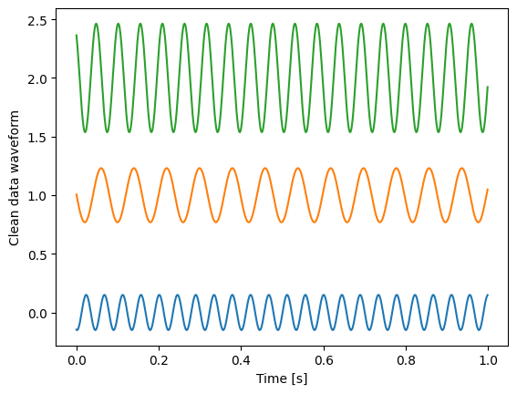
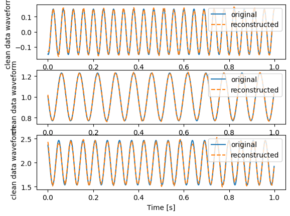

# Remove a common signal from your data
## Goal
We want to remove a common signal which was mixed on top a set of data channels. There are many methods to do so. We will use SVD. Implementations are for example: [scipy.linalg.svd](https://docs.scipy.org/doc/scipy/reference/generated/scipy.linalg.svd.html) or [torch.svd_lowrank](https://pytorch.org/docs/stable/generated/torch.svd_lowrank.html) (which also works on the GPU)

Questions to [David Rotermund](mailto:davrot@uni-bremen.de)

## Creating dirty test data 

```python
import numpy as np
import matplotlib.pyplot as plt

rng = np.random.default_rng()

time_series_length: int = 1000
number_of_channels: int = 100

t: np.ndarray = np.arange(0, time_series_length) / 1000

# Clean data
frequencies = 10 / rng.random((1, number_of_channels))
phase = 2 * np.pi * rng.random((1, number_of_channels))
clean_data: np.ndarray = (
    0.5
    * rng.random((1, number_of_channels))
    * np.sin(t[..., np.newaxis] * 2 * np.pi * frequencies + phase)
    + np.arange(0, number_of_channels)[np.newaxis, ...]
)

# Perturbation
y: np.ndarray = np.sin(t * 2 * np.pi * 1)
mix_coefficients: np.ndarray = 1 + rng.random((number_of_channels)) * 5
perturbation: np.ndarray = y[..., np.newaxis] * mix_coefficients[np.newaxis, ...]

# Dirty data
dirty_data: np.ndarray = clean_data.copy()
dirty_data += perturbation

np.savez(
    "data.npz", clean_data=clean_data, perturbation=perturbation, dirty_data=dirty_data
)


plt.plot(t, clean_data[..., 0:3])
plt.xlabel("Time [s]")
plt.ylabel("Clean data waveform")
plt.show()

plt.plot(t, perturbation[..., 0:3])
plt.xlabel("Time [s]")
plt.ylabel("Perturbation ")
plt.show()

plt.plot(t, dirty_data[..., 0:3])
plt.xlabel("Time [s]")
plt.ylabel("Dirty data ")
plt.show()
```
Let us look at the first three of the 100 channels. 

We get three fully random time series



Sine wave with random amplitudes as common perturbation


Both combined with random mixing coefficients


## Estimating the common signal

```python
import numpy as np
import scipy
import matplotlib.pyplot as plt

file = np.load("data.npz")

clean_data = file["clean_data"]
perturbation = file["perturbation"]
dirty_data = file["dirty_data"].copy()
t: np.ndarray = np.arange(0, dirty_data.shape[0]) / 1000

dirty_data -= dirty_data.mean(axis=0, keepdims=True)
u, s, Vh = scipy.linalg.svd(dirty_data, full_matrices=False)

to_remove = u[:, 0][..., np.newaxis] * Vh[0, :][np.newaxis, ...] * s[0]

dirty_data = file["dirty_data"].copy()
dirty_data -= to_remove

for i in range(0, 3):
    plt.subplot(3, 1, 1 + i)
    plt.plot(t, perturbation[:, i], label="original")
    plt.plot(t, to_remove[:, i], "--", label="reconstructed")
    plt.xlabel("Time [s]")
    plt.ylabel("Perturbation ")
    plt.legend(loc="upper right")
plt.show()

for i in range(0, 3):
    plt.subplot(3, 1, 1 + i)
    plt.plot(t, clean_data[:, i], label="original")
    plt.plot(t, dirty_data[:, i], "--", label="reconstructed")
    plt.xlabel("Time [s]")
    plt.ylabel("clean data waveform")
    plt.legend(loc="upper right")
plt.show()
```

This is the original and the reconstructed pertubation for the first three channels


This is the original clean data and the reconstructed clean data for the first three channels



## Disclaimer

With decreasing number of channels the reconstructions of the pertubation loses quality. This is due to the fact, that the SVD can not distinguish between the common signal which was mixed in and a random common fate of the time series. In this example, where the clean data is generated from sine waves, this effect is especially strong. You should always take a close look at u[:, 0] which is the reconstructed common signal. 
