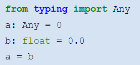
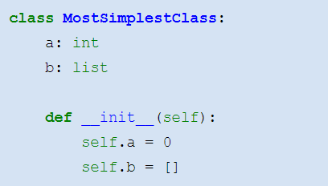
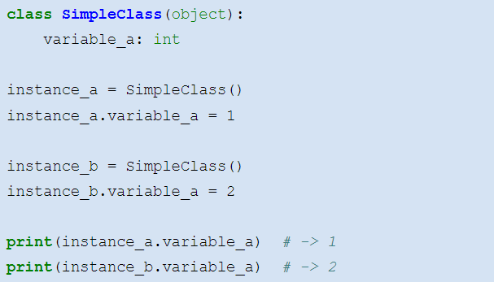
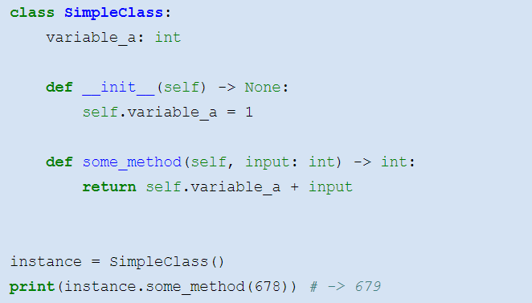
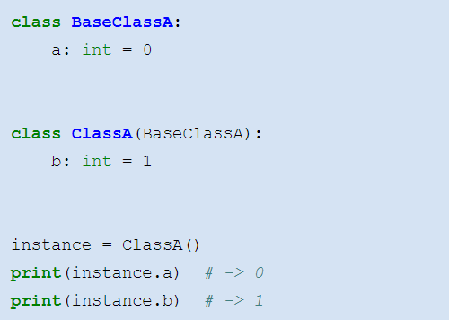
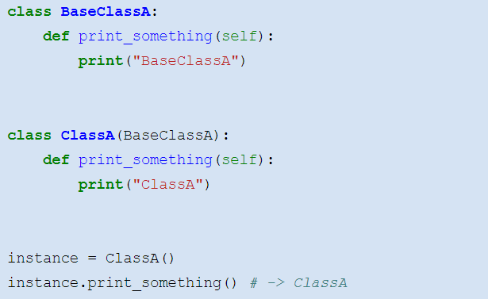
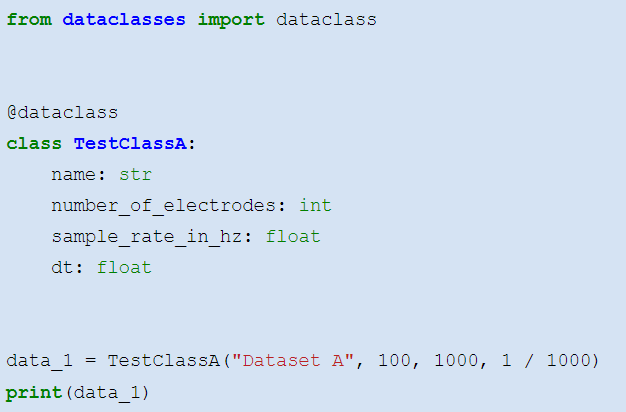
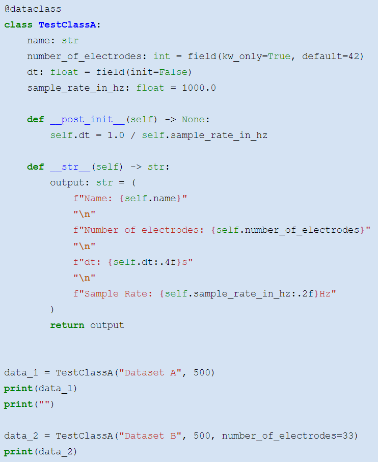
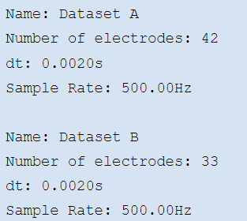
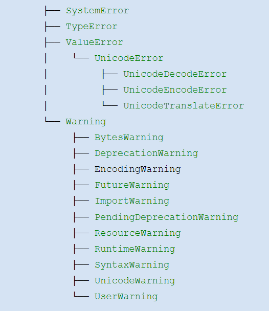

 __Topic \#1__    __Advanced__    __ __    __Programming__    __ __    __Concepts__ 

 __Type __    __annotations__ 

__What__  __ __  __is__  __ __  __it__  __?__

Type annotations specify which type a variable is\.It‘s  optional \, but  very     useful \!

__What__  __ __  __is__  __ __  __it__  __ __  __good__  __ __  __for__  __?__

PEP 484 – Type Hints \(29\-Sep\-2014\):

 _“This _    _PEP aims to provide a standard syntax for type annotations\, opening up Python code to easier static analysis and refactoring\, potential runtime type checking\, and \(perhaps\, in some contexts\) code generation utilizing type information_    _\._ 

 _Of _    _these goals\, static analysis is the most important\. This includes support for off\-line type checkers such as _    _mypy_    _\, as well as providing a standard notation that can be used by IDEs for code completion and refactoring_    _\._ 

 _\[…\]_ 

 _It _    _should also be emphasized that Python will remain a dynamically typed language\, and the authors have no desire to ever make type hints mandatory\, even by convention_    _\.”_ 

__David’s redefinition:__

It is a part of your  automatic documentation  \(like with meaningful variable names\)\. If another person gets your source code they understand it easier\.

Your  editor might thank you \. Do to some new features in Python 3\.10\, the modern editors that do syntax highlighting and error checking have a harder time to infer what you mean\. The more it need to think about what you mean\, the slower your editor might get or even fail to show you syntax highlighting\.

Static   code analysis is really helpful \. It showed me any problems ahead that I would have figured out the hard way otherwise\.

Packages like the just\-in\-time compiler  numba   can produce better results  if you can tell it what the variables are\.

__When__  __ __  __and__  __ __  __how__  __ do __  __we__  __ do __  __it__  __?__

…mostly when we introduce new variables or define functions or classes:

Variables with different types:

…could also be explicit list with ‚or‘ separators…

__Functions__  __\, __  __more__  __ __  __complex__  __ __  __types__  __…__

 __More __    __information__    __:__ 

[https://davrot\.github\.io/pytutorial/python\_basics/python\_typing](https://davrot.github.io/pytutorial/python_basics/python_typing/)[/](https://davrot.github.io/pytutorial/python_basics/python_typing/)

__What__  __ __  __is__  __ a __  __class__  __?__

A class is a   __container__    __ __    __for__    __ __    __data__    __ \(__    __attributes__    __\)__   and   __functions__    __ \(__    __methods__    __\)__  \. They bundle properties of ‚objects‘ and actions that can be performed with/on them\.

Classes help to   __modularize__    __ __    __and__    __ __    __organize__    __ __    __your__    __ __    __code__    __ __  even more than functions\.

 __Class __    __hierarchies__    __ __  are useful for re\-using code which is common for different ‚objects‘

 __Dataclasses__    __ __  are specific classes in Python intended to represent data that ‚belongs together‘\.

__Vehicle__  __:__

wheels  :   int

speed  :   float

accelerate  \(  speed  :   float  \)

stop  \(\)

__Bus\(__  __Vehicle__  __\):__

passengers  :   int

routenr  :   int

intake  :   float

board  \(  nrpass  :   int  \)

__Car\(__  __Vehicle__  __\):__

passengers  :   int

board  \(  nrpass  :   int  \)

__Truck\(__  __Vehicle__  __\):__

company  :   str

weight  :   float

load  \(  weight  :   float  \)

 _parent_    _ _    _class_    _ / _    _superclass_ 

wheels  :   int

speed  :   float

passengers  :   int

litres  :   float

kwh  :   float

accelerate  \(  speed  :   float  \)

stop  \(\)

board  \(  nrpass  :   int  \)

fill  \(  litres  :   float  \)

charge  \(  kwh  :   float  \)

__Electric__  __\(Car\):__

kwh  :   float

charge  \(  kwh  :   float  \)

__Petrol\(Car\):__

litres  :   float

fill  \(  litres  :   float  \)

 _child_    _ _    _class_    _ / _    _subclass_ 

__Hybrid\(Petrol\, __  __Electric__  __\):__

b\) Including and setting attributes \(variables\):

 __please__    __ __    __don‘t__    __ __    __initialize__    __ in __    __attribute__    __ __    __section__    __\!__ 

a\) Defining and instantiating a class:

c\) Including and using methods \(functions\):

c\) multiple inheritance

There are special methods for certain purposes:

 __\_\___    __init__    __\_\_: __  called always when a class is instantiated\. Good for initalizing and setting up a meaningful state for a class instance\.

 __\_\___    __str__    __\_\_: __  called by   __str__    __\(object\)__   and the built\-in functions   __format\(\)__   and   __print\(\) __  to compute the “informal” or nicely printable string representation of an object\. See also   __\_\___    __repr__    __\_\_ __  for the built\-in function   __repr__    __\(\)__  \.

 __super\(\): __  refers to the parent class\. Good to call functions from that class\.  __Example:__

 __More __    __information__    __:__ 

[https://davrot\.github\.io/pytutorial/python\_basics/class](https://davrot.github.io/pytutorial/python_basics/class/)  [/](https://davrot.github.io/pytutorial/python_basics/class/)

The  __dat__  __a__  __class__  is very similar to normal classes\, but it requires  __type __  __annotations__  __ __ thus serving a good programming style\. You have to   __import__    __ __    __from__    __ __    __dataclasses__    __ __  and use a decorator   __@__    __dataclass__    __ __  when you define a dataclass:

 __there__    __ will __    __be__    __ an __    __error__    __ __    __without__    __ __    __these__    __ __    __annotations__    __\!__ 

__A __  __dataclass__  __ __  __has__  __ an __  __automatic__  __ \_\___  __init__  __\_\_\(\) __  __method__  __ __  __which__  __ __  __can__  __ __  __be__  __ __  __used__  __ __  __to__  __ __  __populate__  __ __  __the__  __ __  __attributes__  __…__

__Further Features I__

 __default\_factory__   can be used to specify automatic generation of default values\.

TestClassA\(name=''\, number\_of\_electrodes=0\, dt=0\.0\, sample\_rate\_in\_hz=0\.0\)

__Further Features I__

defaults     can   also   be     specified   in   the     class     definiton   \(  please   do not do   this     to     mutables  \!\)

attributes     can     be     spared     from     initialization

attributes     can     explicitly     be     specified     as     keywords

 __\_\___    __post\_init__    __\_\_\(\) __  if you have to do some init of your own…

 __\_\___    __str__    __\_\_\(\) __  for a nice printout\!

__Why__  __ __  __dataclasses__  __?__

putting data together into meaningful containers…

appropriate type handling…

versatile and safe initialization methods…

__makes__  __ __  __comparing__  __ __  __data__  __ __  __sets__  __ easy…\!__

__…__  __compare__  __ __  __everything__

 __More __    __information__    __:__ 

[https://davrot\.github\.io/pytutorial/python\_basics/dataclass](https://davrot.github.io/pytutorial/python_basics/dataclass/)[/](https://davrot.github.io/pytutorial/python_basics/dataclass/)

 __Catch __    __me__    __ __    __if__    __ __    __you__    __ __    __can__    __\!__ 

syntax errors

logical errors

data inconsistencies

exceptions

inadequate usage or user input

…

Assert checks if a condition is true\. If not\, it issues and error and stops program execution\. Example:

Use it often to make your code safe to use\, or to discover inconsistencies in input data\!

import     numpy     as     np

def     solve\_quadratic  \(  a  :   float  \,   b  :   float  \,   c  :   float  \) \->   tuple  \[  float  \,   float  \]:

      assert     isinstance  \(  a  \,   float  \)\,   "  argument   'a' must   be     float  \!"

      assert     isinstance  \(  b  \,   float  \)\,   "  argument   'b' must   be     float  \!"

      assert     isinstance  \(  c  \,   float  \)\,   "  argument   'c' must   be     float  \!"

      assert     a     \!=     0  \,   "  argument   a must   be   non\-zero\,   otherwise     it's   not a   quadratic     equation  \!"

      sqrt\_arg     =     \-  4  \*  a  \*  c  \+  b  \*\*  2

      assert     sqrt\_arg     >=     0  \,   "  root     argument   must   be   positive   for   non\-  imaginary     solutions  \!"

      x1     =   \(  \+  np  \.  sqrt  \(  \-  4  \*  a  \*  c  \+  b  \*\*  2  \)  \-  b  \)  /  2  \*  a

      x2     =   \(  \-  np  \.  sqrt  \(  \-  4  \*  a  \*  c  \+  b  \*\*  2  \)  \-  b  \)  /  2  \*  a

      return     x1  \,   x2

import     numpy     as     np

def     solve\_quadratic  \(  a  :   float  \,   b  :   float  \,   c  :   float  \) \->   tuple  \[  float  \,   float  \]:

      x1     =   \(  \+  np  \.  sqrt  \(  \-  4  \*  a  \*  c  \+  b  \*\*  2  \)  \-  b  \)  /  2  \*  a

      x2     =   \(  \-  np  \.  sqrt  \(  \-  4  \*  a  \*  c  \+  b  \*\*  2  \)  \-  b  \)  /  2  \*  a

      return     x1  \,   x2

solve\_quadratic  \(  "A"  \,   "B"  \,   "C"  \)

---

Assert is better than if and exception thrown by hand, since ist shorter and ist immediately clear without adding a comment that some checking is performed…

__Try … __  __Except__  __ … Else … __  __Finally__  __ …__

Errors need not terminate your program\. Each error raises an exception\, and you can catch that exception and handle it properly\!

__Example__  __ __  __for__  __ different __  __exceptions__  __…__

__…__  __and__  __ __  __example__  __ __  __for__  __ __  __handling__  __ an __  __exception__  __ __  __nicely__  __:__

try this piece of code…

for     i     in     range  \(  n\_files  \):

      try  :

          \# open file\[  i  \] for read

          \# read neural activity into temp array

          \# normalize temp array by its sum

      except     OSError  :

          \# assign None to data\[  i  \]

      else  :

          \# assign temp array to data\[  i  \] 

      finally  :

          \# close file if open

print  \(  "Successfully read existing data files\.\.\."  \)

… __if__  __ __  __the__  __ __  __specified__  __ __  __exception__  __ __  __occurred__ \, execute this piece of code  __\(‚__  __error__  __ __  __handling__  __‘\)__ …

… __otherwise__ \, execute this piece of code\. You can put code here which runs only correctly when the exception did not occur…

… __in __  __any__  __ __  __case__ \, execute this piece of code\, irrespectively of errors having occurred/not occurred  __\(‚clean\-__  __up__  __‘\)__ \. When an unhandled exception occurred\, execution stop after this code\!

 __division__    __ __    __by__    __ __    __zero__    __ __    __occurs__    __\!__ 

 __everything__    __ __    __is__    __ okay\!__ 

 __file__    __ __    __does__    __ not __    __exist__    __\, __    __or__    __ __    __is__    __ __    __corrupt__    __\!__ 

__General form\, __  __example__  __:__

for     i     in     range  \(  n\_files  \):

      try  :

          \# open file\[  i  \] for read

          \# read neural activity into temp array

          \# normalize temp array by its sum

      except     OSError  :

          \# assign None to data\[  i  \]

      else  :

          \# assign temp array to data\[  i  \] 

      finally  :

          \# close file if open

print  \(  "Successfully read existing data files\.\.\."  \)

__Possible__  __ __  __exceptions__  __…__

…and you can define your own\!

__Exceptions__  __ __  __have__  __ __  __associated__  __ __  __information__  __ in __  __their__  __ __  __attributes__

__Raising__  __ __  __exceptions__

…or a  __newly__  __ __  __defined__  __ __  __exception__ …

When you determine that something goes wrong\, you can yourself raise an exception…

…either a  __matching__  __\, __  __predefined__  __ __  __one__

 __Using__    __ __    __the__    __ __    __debugger__ 

The VSCode debugger lets you follow\, monitor\, and manipulate the execution of program code…

__Examples__  __ __  __of__  __ __  __actions__  __ __  __possible__  __:__

step over\, step in\, step out

continue

breakpoints\, conditional breakpoints\, function breakpoints

inspection and change of variables

monitoring

…

 __Interactive __    __demonstration__    __…__ 

 __More __    __information__    __:__ 

[https://davrot\.github\.io/pytutorial/workflow/vscode\_debug](https://davrot.github.io/pytutorial/workflow/vscode_debug/)  [/](https://davrot.github.io/pytutorial/workflow/vscode_debug/)

[https://davrot\.github\.io/pytutorial/python\_basics/exceptions](https://davrot.github.io/pytutorial/python_basics/exceptions/)  [/](https://davrot.github.io/pytutorial/python_basics/exceptions/)

[https://davrot\.github\.io/pytutorial/python\_basics/assert](https://davrot.github.io/pytutorial/python_basics/assert/)  [/](https://davrot.github.io/pytutorial/python_basics/assert/)

