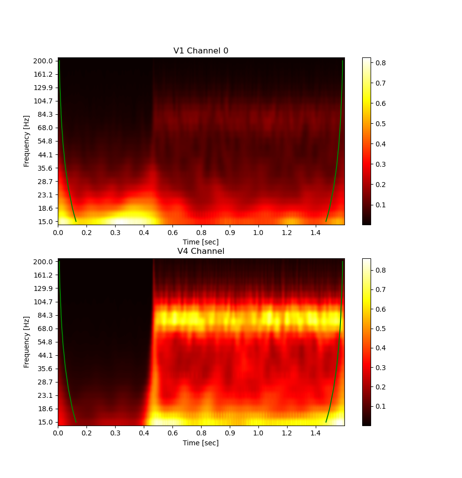
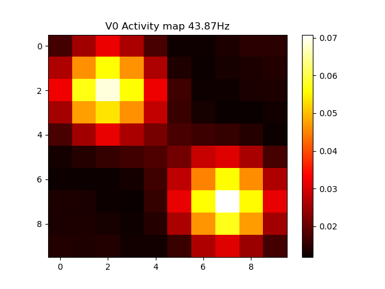
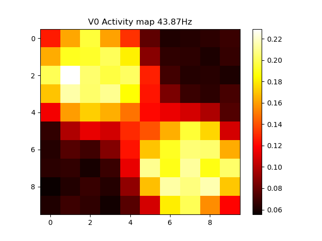
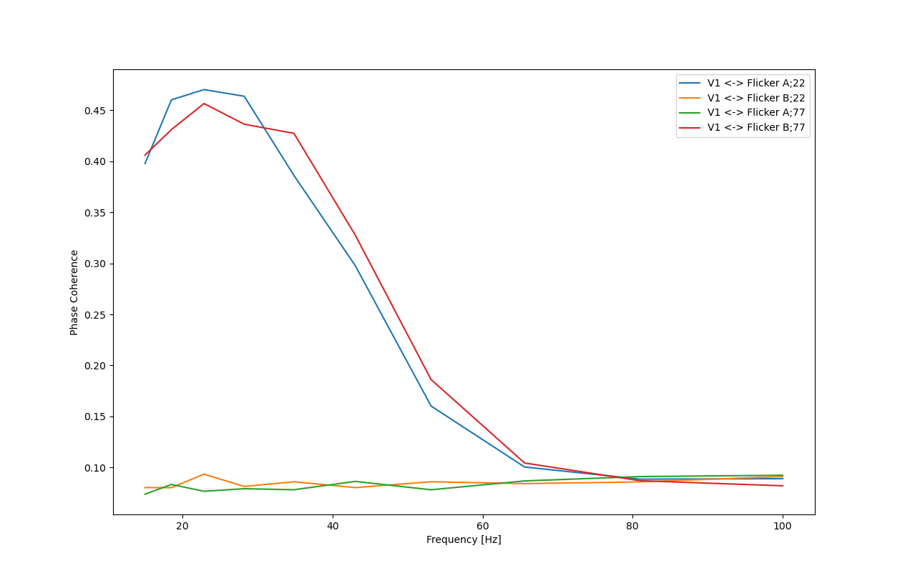
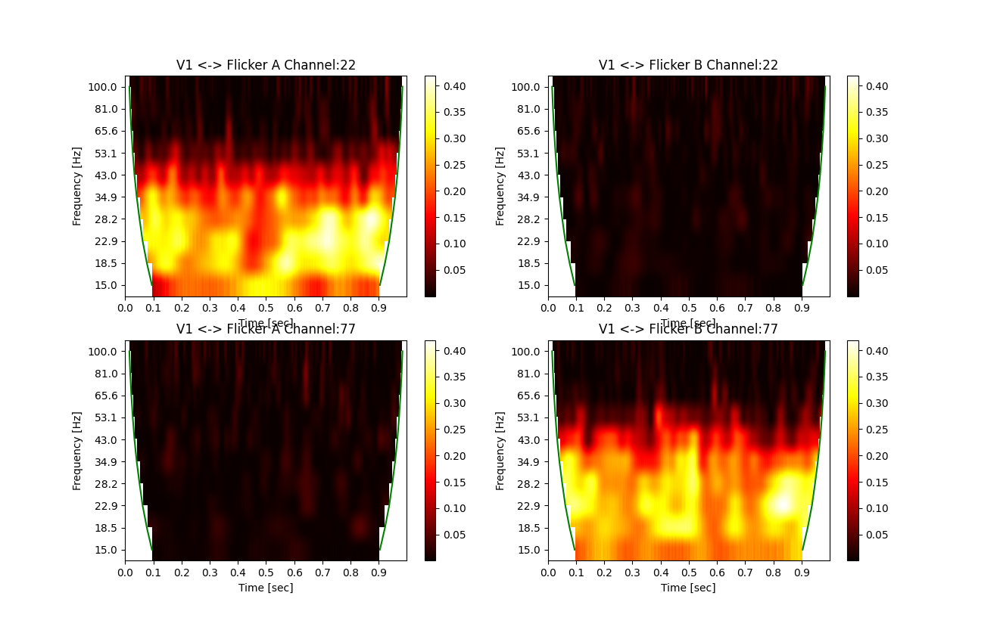
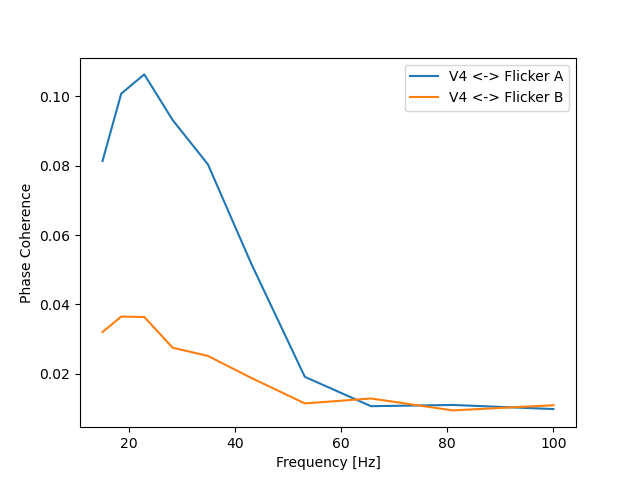
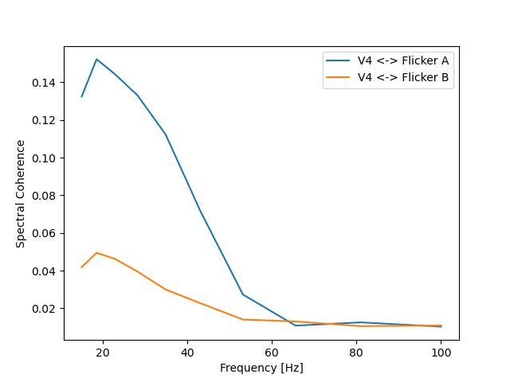
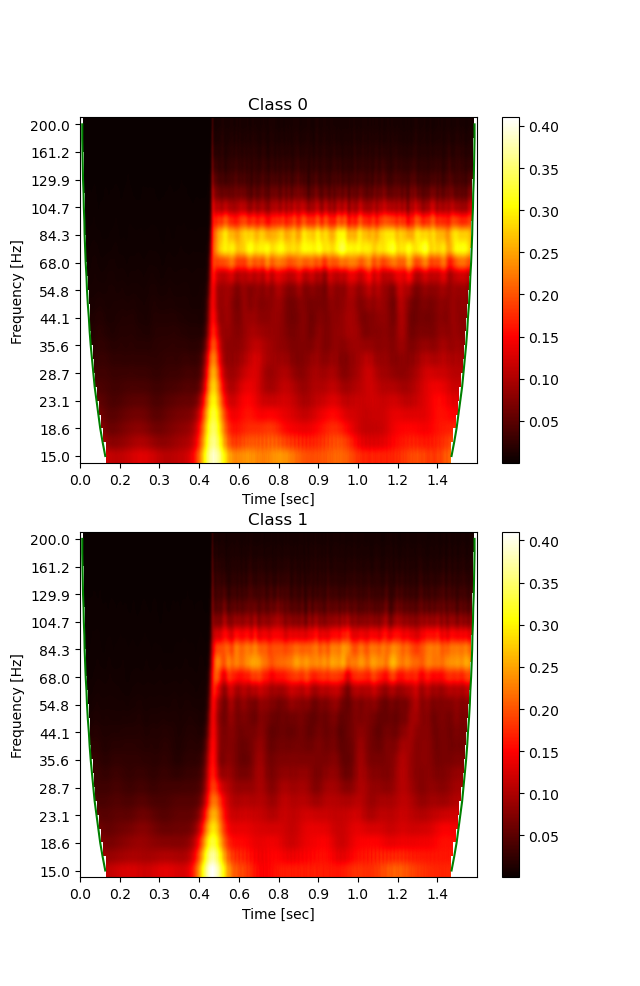
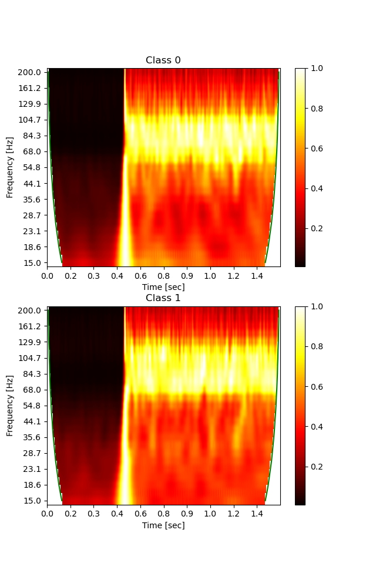
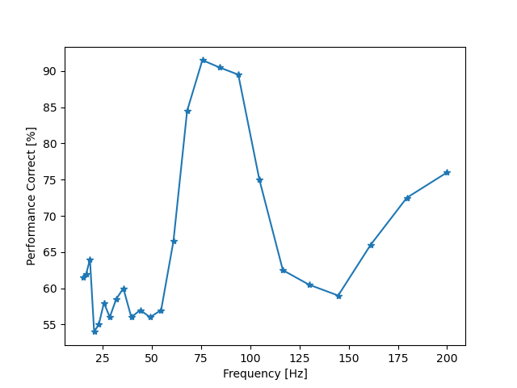

Errors are an option... 

# Mandatory Tasks

## 2 

Basic: 



Scaled by divison max() for every individual frequency band:


## 3

without preparing the data via /= std: 



with equalizing the power via /= std (obviously not the best idea in this case):



## 4

Phase Coherence




Spectral Coherence




## 5

Phase Coherence




Spectral Coherence




## 6

{: .topic-optional}
Don't normalize the time series! 

i.e. don't do something like this: 

```python
data -= data.mean(axis=1, keepdims=True)
data /= data.std(axis=1, keepdims=True)
```
Otherwise you will not classify anything.



Scaled by divison max() for every individual frequency band (Bad times happen):



## 7

{: .topic-optional}
Don't normalize the time series! 

i.e. don't do something like this: 

```python
data -= data.mean(axis=1, keepdims=True)
data /= data.std(axis=1, keepdims=True)
```
Otherwise you will not classify anything.




