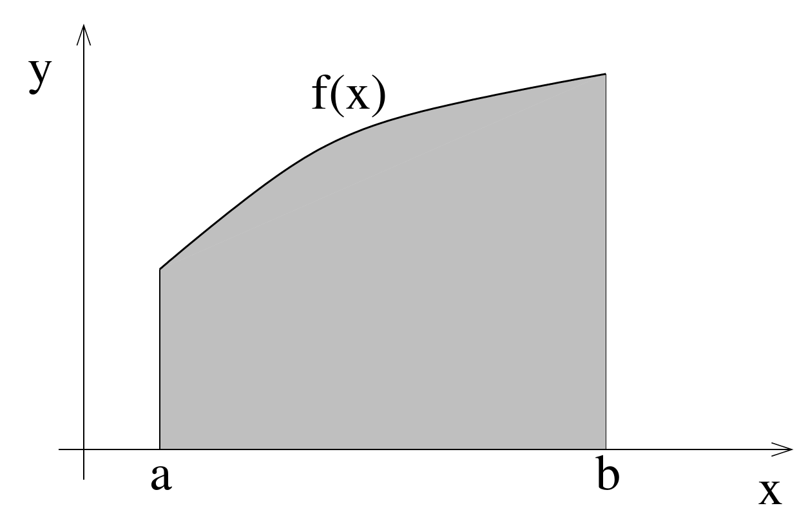
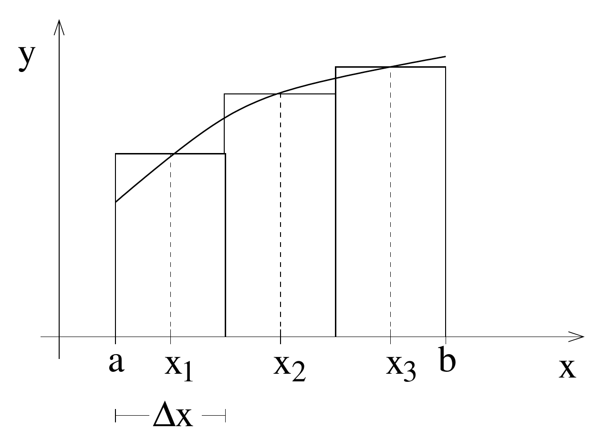
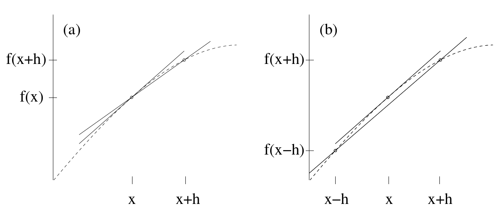
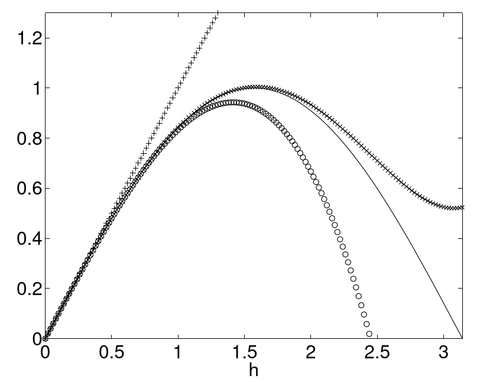

# Integration and Differentiation
{:.no_toc}

<nav markdown="1" class="toc-class">
* TOC
{:toc}
</nav>

Questions to [David Rotermund](mailto:davrot@uni-bremen.de)

*By Jan Wiersig, modified by Udo Ernst and translated into English by Daniel Harnack.*


## Numerical Integration
In many cases, the antidervative can not be expressed in closed form via standard functions. This makes numerical methods for the approximation of the antiderivative necessary ('quadrature'). The intention of this chapter is to introduce and explain the basic concepts of numerical integration. For this, we consider definite integrals of the form

$I = \int_a^b f(x)dx$

with $-\infty < a < b < \infty$ and \quoting{sufficiently smooth} function

$f(x)$. Such an integral can be interpreted as the area (with sign) under the curve $f(x)$ (see fig.7.1).




Figure 7.1.: Definite integral with boundaries a and b as the area under a curve f(x).

An example for which numerical integration is useful are one-dimensional ordinary differential equations, that can be written as definite integrals:

$\frac{dy}{dx} = f(x)$ and $y(a) = 0$ $\Rightarrow$ $y(b) = \int_a^bf(x)dx = I \, $.

### Midpoint Rule
The simplest way of numerical integration is via the midpoint rule, or also rectangle method. Here, the interval of integration is split into sub-intervals as shows in fig. 7.2. The sub-intervals have a width of $\Delta x = (b-a)/N$, the midpoints of these sub-intervals are $x_i = a+(i-1/2)\Delta x$ with $i=1,\ldots,N$. The points $x_i$ are also called supporting points.



Figure 7.2.: Scheme of the midpoint rule.

The integral is then replaced by the Riemann sum:

$I \approx I_M = \sum_{i=1}^N f(x_i)\Delta x$

To illustrate the accuracy of this approximation, consider the following integral of the Gaussian bell-curve

$I = \int_0^1\frac{2}{\sqrt{\pi}}e^{-x^2}dx \, .$

Due to the regular occurrence of this integral in many contexts, the corresponding primitive, the so called 'error'-function erf$(x)$, was defined. In the literature, we find

$I = \mbox{erf}(1) = 0.842701...$

The following table shows the comparison of the exact solution with the result of the midpoint rule for different numbers of supporting points $N$.

|$N$	|$I_M$|	$\Delta I = I-IM$|
|---|---|---|
|5	|0.844088|	-0.00138691|
|10	|0.843047|	-0.00034613|
|20	|0.842787|	-0.00008649|
|60	|0.842711|	-$9.61\, 10^{-6}$|

From the table we can derive that the error is proportional to $1/N^2$ respectively $\Delta x^2$. This can also be shown analytically. For this we first examine the part integral

$I_i = \int_{x_i-\Delta x/2}^{x_i+\Delta x/2} f(x)dx \, .$

The sub-interval $[x_i-\Delta x/2,x_i+\Delta x/2]$ should be chosen small enough, such that the function $f(x)$ varies sufficiently little in the interval. Within this interval, we can limit the consideration to the first terms of the Taylor series:

$f(x) = f(x_i)+f'(x_i)(x-x_i) + f''(x_i)\frac{(x-x_i)^2}{2} + f'''(x_i)\frac{(x-x_i)^3}{6} + {\cal O}((x-x_i)^4) \, . $

Substitution shows that some terms vanish

$I_i  =  f(x_i)\Delta x+f'(x_i)\frac{(x-x_i)^2}{2}\Big|_{x_i-\Delta x/2}^{x_i+ \Delta x/2}+f''(x_i)\frac{(x-x_i)^3}{6}\Big|_{x_i-\Delta x/2}^{x_i+  \Delta x/2}  +f'''(x_i)\frac{(x-x_i)^4}{24}\Big|_{x_i-\Delta x/2}^{x_i+ \Delta x/2} + {\cal O}(\Delta x^5) $

$I_i = f(x_i)\Delta x+ f''(x_i)\frac{\Delta x^3}{24}+{\cal O}(\Delta x^5)$

Writing now with central derivation

$ f''(x_i) = \frac{f'(x_i+\Delta x/2)-f'(x_i-\Delta x/2)}{\Delta x}+ {\cal O}(\Delta x^2) \, .$

Insertion yields

$ I_i = f(x_i)\Delta x+ \left[f'(x_i+\Delta x/2)- f'(x_i-\Delta x/2)\right]\frac{\Delta x^2}{24}+{\cal O}(\Delta x^5) \, . $

Taking the sum $I = \sum_{i=1}^N I_i$, many terms will vanish, thus

$I-I_M  = \frac{\Delta x^2}{24}\left[f'(b)-f'(a)\right]+{\cal O}(\Delta x^4) \ .$

Hence, the error is proportional to $\Delta x^2$ and depends on the derivations at the boundaries of the interval.

### Trapezoidal Rule

Instead of approximating the area by little rectangles, here, trapezoids are used (see fig.7.3).


Figure 7.3.: Scheme of the trapezoid rule. The dashed line illustrates the division of a trapezoid into a triangle and a rectangle.

The width of the sub-intervals is $\Delta x = (b-a)/(N-1)$. The supporting points lie at the borders of the sub-intervals: $x_i = a+(i-1)\Delta x$ with $i=1,\ldots,N$.

In the part integral $I_1$, the area of the trapezoid can be split up into an area of a triangle and the area of a rectangle (see fig. 7.3),

$ I_1 = \int_{x_1}^{x_2}f(x)dx \approx f(x_1)\Delta x+\frac{1}{2}[f(x_2)-f(x_1)]\Delta x = \frac{1}{2}\left[f(x_1)+f(x_2)\right]\Delta x$

It follows the 'compound' trapezoid rule:

$ I \approx I_T =\frac{1}{2}\left[f(x_1)+f(x_N)\right]\Delta x + \sum_{i=2}^{N-1} f(x_i)\Delta x \, .$

Note that the trapezoid rule contains the boundaries $a$ and $b$ of the interval. This is referred to as a closed formula. In contrast, the midpoint rule does not contain the boundaries of the interval (open formula). The latter is an advantage, in case that integrable singularities exist at $x=a$ or $x=b$.

The error approximation gives, in analogy to the procedure used for the midpoint rule,

$I-I_T  = -\frac{\Delta x^2}{12}\left[f'(b)-f'(a)\right]+{\cal O}(\Delta x^4) \ .$

Thus, the trapezoid rule is less accurate by a factor of two than the midpoint rule. This is a surprising result, considering the two figures 7.2 and 7.3 which suggest the opposite. The seeming contradiction is resolved when realizing that the procedure of the midpoint rule partly compensates positive and negative deviations from the exact solution.

### Simpson's Rule

Simpson's rule is often used since it is more accurate than the midpoint or the trapezoid rule. The idea behind Simpson's rule is to approximate the integrand function as a parabola between three supporting points. For this parabola, the integral can be found analytically.

As in the trapezoid rule, the supporting points $x_i = a+(i-1)\Delta x$ are used with $i=1,\ldots,N$ and $N$ odd. The width of the sub-intervals is again $\Delta x = (b-a)/(N-1)$. The 'compound' Simpson's rule reads

$I_S  =  \frac{\Delta x}{3}\left(f(x_1)+4f(x_2)+2f(x_3)+\ldots + 2f(x_{N-2})+4f(x_{N-1})+f(x_N)\right) \ .$

The error shall be given without strict derivation:

$I-I_S = {\cal O}(\Delta x^4) \ .$

The error term is of higher order as compared to the trapezoid rule. Thus we expect the error to be much smaller with the Simpson's rule. Figure.7.4 confirms this expectation. With the same number of supporting points, Simpson's rule gives far more accurate values for the integral than the trapezoid rule.


Figure 7.4.: Comparison of the absolute errors between the trapezoid rule and Simpson's rule when evaluating the integral $I = \int_0^1\frac{2}{\sqrt{\pi}}e^{-x^2}dx$ as a function of the number of supporting points $N$. Note the double logarithmic plotting. For large $N$, rounding errors dominate.

## Integration with Matlab
Matlab provides several routines for integration. The most important one for one-dimensional integrals is

```python
y = quad(f,a,b);
```

Here, $f$ is the integrand function and $a$ and $b$ are the boundaries of the interval. This routines uses an adaptive Simpson rule. It is adaptive in the sense that more supporting points are used where the function varies strongly. Invoking the routine can be done by

```python
y = quad(@(x)exp(x),0,1);
```

or

```python
y = quad(@(x)1.0./(1.0+x.\pow 2),0,1);
```

## Miscellaneous
Further interesting methods and aspects of numerical integration are

* Non-uniformly distributed supporting points:
  - adaptive quadrature methods
  - Gaussian quadrature
* Improper integrals, i.e. the function or the interval of integration is boundless
* Multidimensional integrals, e.g. $\int\int f(x,y)\,dxdy$

## Numerical Differentiation

Many applications demand the approximate differentiation of functions via a numerical method. Finding the analytical differentiation is for example impossible if the function to be differentiated is by itself only given numerically.

### Right-sided Differentiation
The differentiation of a function $f(x)$ is defined by

$f'(x) = \lim_{h\to 0}\frac{f(x+h)-f(x)}{h} \ .$

Since $h=0$ is numerically impossible, one has to choose $h$ \quoting{suitably small}. Geometrically this means that the sought tangent on $f$ at the position $x$ is approximated by the secant through $x$ and $x+h$, see fig.7.5(a).



Figure 7.5.: Approximation of the slope of the tangent on the curve $f$ at the position $x$ by the slope of the secant (a) in $x$ and $x+h$ resp. (b) in $x-h$ and $x+h$. The latter is a decidedly better approximation.

To estimate the resulting approximation error, we consider the Taylor series up to the second order

$f(x+h) = f(x)+f'(x)h+\frac{f''(x)}{2}h^2+{\cal O}(h^3) \ .$


Figure 7.6 illustrates the Taylor series of the sine function at $x=0$, $\sin{(h)} = h - h^3/6+h^5/120+{\cal O}(h^7)$. It can be seen that the Taylor series becomes a better and better approximation of the sine function with increasing order. Close to the point of construction of the Taylor series (here $x=0$), the original function can be replaced in a controlled manner by its Taylor series of a suitable order.




Figure 7.6.: Sine function (continuous line) and the corresponding Taylor series including the 1. order(+), 3. order (o) and 5. order (x).

Rewriting the above Taylor series results in the relation

$f'(x)  =  \frac{f(x+h)-f(x)}{h}+{\cal O}(h) \ .$

The left hand side is the exact derivative. The right hand side is the right-handed derivative and the approximation error, also called truncation error or discretization error, which is linear in $h$. The truncation error can thus be made small when choosing $h$ accordingly. Unfortunately, when $h$ gets to small, rounding errors start to contribute significantly such that an optimization of the trade-off between truncation error and rounding error has to be found. This is illustrated in figure 7.7 for the example of $f(x) = x^2$ at the position $x=1$. The total error is plotted on a logarithmic scale

$\Delta(h) = \left|f'(x)-\frac{f(x+h)-f(x)}{h}\right| \ ,$

as a function of $h=10^{-i}$, $i = 1,2,\ldots, 25$. For $f'(x)$ the known analytical solution $2x$ is inserted. The linear decrease of the truncation error for $h>10^{-8}$ is apparent. For $h\leq \varepsilon \approx 2\times 10^{-16}$, the rounding error dominates, where $\varepsilon$ is the machine accuracy. The optimal value $h \approx 10^{-8}$ is explained by the fact that the truncation error ${\cal O}(h)$ and the rounding error ${\cal O}(\varepsilon/h)$ (denominator/numerator) are in balance if $h \approx \sqrt{\varepsilon} \approx 10^{-8}$.


Figure 7.7.: Total error of the right-sided derivation of $f(x) = x^2$ at $x=1$. Note the double logarithmic plotting.


### Centered Differentiation

Consider the following Taylor series

$f(x+h) = f(x)+f'(x)h+\frac{f''(x)}{2}h^2+\frac{f'''(x)}{6}h^3+ {\cal O}(h^4)$

$ f(x-h) = f(x)-f'(x)h+\frac{f''(x)}{2}h^2-\frac{f'''(x)}{6}h^3+ {\cal O}(h^4) \, .$

Subtraction of both equation gives

$f'(x) = \frac{f(x+h)-f(x-h)}{2h}+{\cal O}(h^2) \ .$

The right hand side is the centered first derivation approximation. Note that the truncation error now decreases quadratically with the decrease of the step width $h$, although the evaluation of this formula is not more extensive than the one of the right-sided derivation. In both cases, the function $f$ has to be calculated at two points. In contrast to the right-sided derivation, the sought slope of the tangent on $f$ at the position $x$ is now approximated by the slope of the secant through $x-h$ and $x+h$ (see fig. 7.6(b)).

If we add the Taylor series for $f(x+h)$ and $f(x-h)$ instead of subtracting them, and then divide by $h^2$, we obtain the centered second derivation approximation

$f''(x) = \frac{f(x+h)-2f(x)+f(x-h)}{h^2}+{\cal O}(h^2) \ .$

The truncation error is also quadratic in $h$.
