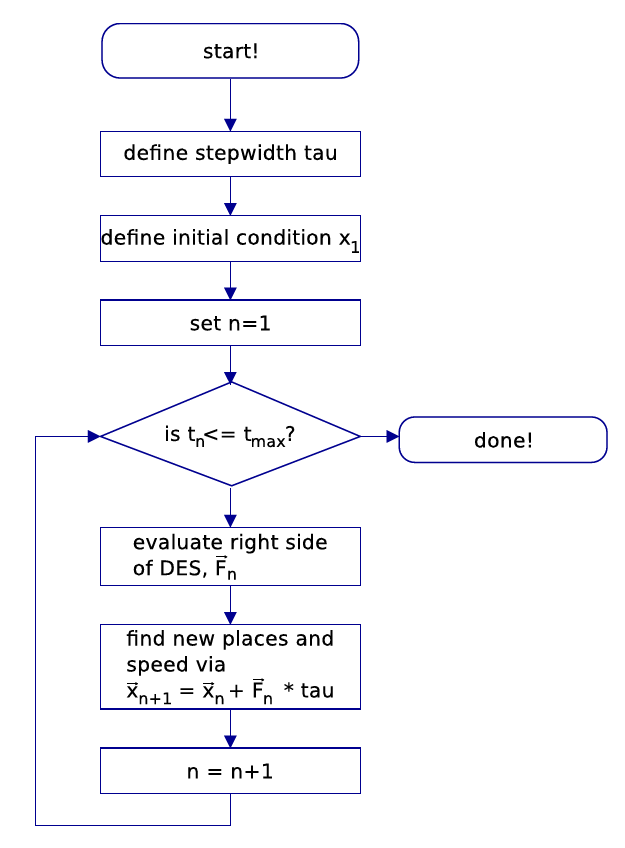
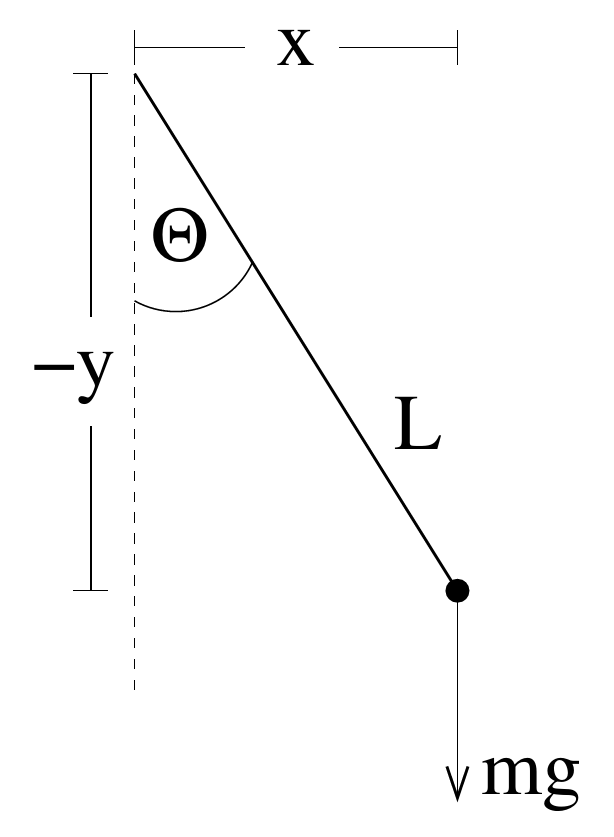
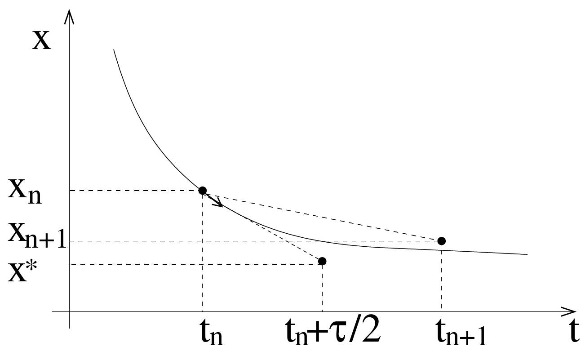
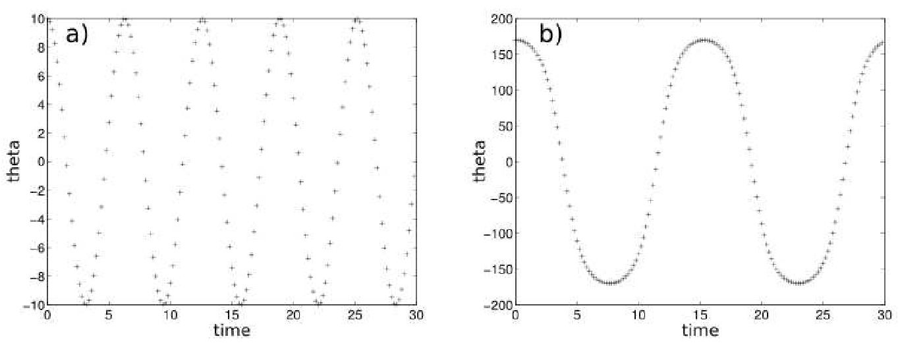
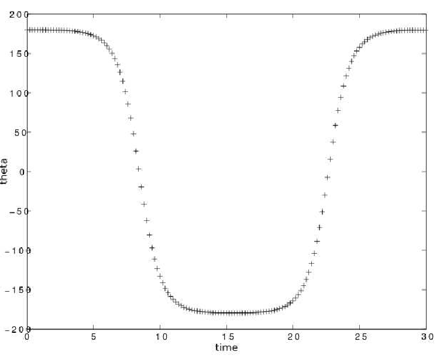

# Differential Equations
{:.no_toc}

<nav markdown="1" class="toc-class">
* TOC
{:toc}
</nav>

Questions to [David Rotermund](mailto:davrot@uni-bremen.de)

*By Jan Wiersig, modified by Udo Ernst and translated into English by Daniel Harnack.*

## Ordinary Differential Equations
In many fields of science, problems occur where one or several quantities vary dependent on time, e.g. oscillations or decay processes. The description of these processes can be formalized by differential equations. As a simple example, radioactive decay may serve. An amount of radioactive material is give at time $t = 0$. We are looking for a function $x(t)$ that gives the amount of the material $x$ which is still present at time $t$. The rate at time $t$ by which the radioactive material decays is proportional to the amount of the material $x(t)$ that exists at time $t$. From these considerations, the following differential equation can be derived:

$\dot{x} = -\alpha x$

with decay constant $\alpha > 0$. This differential equation is referred to as \quoting{ordinary}, since it only includes the derivative with respect to one quantity (here time $t$). It is furthermore a differential equation of '1. order', since only the first derivative is taken.

The solution of a differential equation is not a number, but a function. Here, the solution is $x(t) = x_0e^{-\alpha t}$, which can be proven by taking the first derivative. Unfortunately, in most practical cases, a differential equation can not be be solved analytically. This holds especially for ordinary systems of differential equations. An example is the Newtonian mechanics of a particle

$m\ddot{\vec{r}} = \vec{F}(\vec{r},\dot{\vec{r}},t)$

with place $\vec{r} = (x,y,z)$, velocity $\vec{v} = \dot{\vec{r}}$, acceleration $\ddot{\vec{r}}$, mass $m$, force $\vec{F}$ and time $t$. This is an ordinary system of differential equations of order 2, since the second derivative with respect to time is taken. Typically one is interested in an initial value problem: Given shall be the place $\vec{r}(0)$ and the velocity $\vec{v}(0)$ at the starting time, sought is the place $\vec{r}(t)$ and velocity $\vec{v}(t)$ at a later time $t$.

Alternatively to the previous notation, the differential equation can also be interpreted as an ordinary system of differential equations of 1. order with double the number of variables

$\dot{\vec{r}} = \vec{v}$

$m\dot{\vec{v}} = \vec{F}(\vec{r},\vec{v},t) \ .$

Using the 'phase space variable' $\vec{x} = (\vec{r},\vec{v})$, it can be transformed to a more compact form

$\dot{\vec{x}} = \vec{\tilde{F}}(\vec{x},t) \ .$

Here, the first three components of $\vec{\tilde{F}}$ are equal to $\vec{v}$ and the last three components equal to $\vec{F}/m$. One can see that it is sufficient to consider ordinary systems of differential equations of 1. order. Note that in the following notation, the tilde $\tilde{}$ is suppressed.

### Euler Method




Figure 8.1.: Flow plan for the Euler integration scheme.
The aim is to find the solution of the initial value problem of the differential equation system (DES)

$\dot{\vec{x}} = \vec{F}(\vec{x},t)$

numerically. For this, we first replace the differential quotient by the right sided derivation

$\frac{\vec{x}(t+\tau)-\vec{x}(t)}{\tau} + {\cal O}(\tau) = \vec{F}(\vec{x},t)$

respectively

$\vec{x}(t+\tau) = \vec{x}(t) + \vec{F}(\vec{x},t)\tau + {\cal O}(\tau^2) \ .$

The truncation error is of 2. order in the step width $\tau$. By following notation we indicate the discretization in time: $t_n = (n-1)\tau$, $\vec{x}_n = \vec{x}(t_n)$ and $\vec{F}_n = \vec{F}(\vec{x}(t_n),t_n)$, where $n = 1,2,\ldots$. The method of Euler finally follows:

$\vec{x}_{n+1} = \vec{x}_n + \vec{F}_n\tau \ .$

This method is illustrated in figure 8.2.


Figure 8.2.: This figure shows a comparison between the true solution (continuous line) and a numerical solution found by the Euler method in one time step (dotted).

Schematically, the algorithm is as follows:

* Choose a step width $\tau$
* Specify an initial condition $\vec{x}_1$
* Set the counter $n$ to $1$
* While $t_n \leq t_{\mbox{max}}$:
  - Evaluate the right side of the DES$\vec{F}_n$
  - Find the new places and velocities via $\vec{x}_{n+1} = \vec{x}_n + \vec{F}_n\tau$
  - Increase the counter by 1
    
The result is a trajectory $\vec{x}_1, \vec{x}_2, ...$, which approximates the (in the general case unknown) true solution $x(t)$.

The local error is characterized as the truncation error per time step. It is of order ${\cal O}(\tau^n)$, which gives $n=2$ for the method of Euler. The global error is calculated from the time interval of the length needed to calculate the trajectory $t_{\mbox{max}} = N\tau$. $N$ is the number of time steps. An approximation for the maximal error is

$\mbox{global error} \propto N\times\mbox{(local error)} = N{\cal O}(\tau^n) = t_{\mbox{max}} {\cal O}(\tau^{n-1}) \ . $

The global error of the method of Euler is thus of order ${\cal O}(\tau)$.

### Example: The Planar Pendulum



Figure 8.3.: Schematic depiction of a planar pendulum.

As an example we will discuss the planar pendulum. The pendulum consists of a point-shaped mass $m$, that is fixed on a massless rod of length $L$ (see fig. 8.2). The only degree of freedom of this system is the angle of deflection $\Theta(t)\in [-\pi,\pi]$. The total energy is the sum of kinetic and potential energy

$E = \frac{1}{2}m\left(\dot{x}^2+\dot{y}^2\right)+mgy$

with gravitational acceleration $g$. From fig. 8.2, the following relations can be extracted:

$x = L\sin{\Theta} $

$y = -L\cos{\Theta} \, .$

Taking the time derivation while considering $\dot{L} = 0$

$\dot{x} = L\dot{\Theta}\cos{\Theta} $

$\dot{y} = L\dot{\Theta}\sin{\Theta} $ .

This yields

$\dot{x}^2+\dot{y}^2 = L^2\dot{\Theta}^2\left(\sin{\Theta}^2+\cos{\Theta}^2\right) = L^2\dot{\Theta}^2 \, .$

Insertion into the energy equation finally yields

$E = \frac{1}{2}mL^2\dot{\Theta}^2-mgL\cos{\Theta} \, .$

This is the energy of the pendulum, expressed by the angle of deflection $\Theta$ and the respective angular velocity $\dot{\Theta}$. An equation of motion for the angle can be derived from the conservation of energy

$\dot{E} = mL^2\dot{\Theta}\ddot{\Theta}+mgL\dot{\Theta}\sin{\Theta} \stackrel{!}{=} 0 \, .$

This gives the equation of motion for the planar pendulum

$\ddot{\Theta} = -\frac{g}{L}\sin{\Theta} \, .$

In the approximation of small deflections, the problem can be solved analytically. With $\sin{\Theta}\approx\Theta$, the differential equation of the harmonic oscillator follows:

$\ddot{\Theta} = -\frac{g}{L}\Theta \, .$

We thus choose the ansatz

$\Theta(t) = C_1\cos\left(\omega t+C_2\right)$

with amplitude $C_1$, phase $C_2$ and angular frequency $\omega$. Taking the second derivative of time yields

$\ddot{\Theta} = -\omega^2\Theta \quad\Rightarrow\quad \omega = \sqrt{\frac{g}{L}} \, .$

The known result is, that in the approximation of small deflections, the period of oscillation is independent of the deflection.

The general case of arbitrarily big deflections is not as easy to handle. We will solve this problem numerically. The analysis above shows, that it is sensible to choose $\sqrt{L/g}$ as the natural unit of time, i.e.

$t = \tilde{t}\sqrt{\frac{L}{g}} \, .$

The important point is, $\tilde{t}$ is a dimensionless quantity. This choice of scaling yields

$\frac{d^2\Theta}{dt^2} = \frac{d^2\Theta}{d\tilde{t}^2}\frac{g}{L} = -\frac{g}{L}\sin{\Theta} \, .$

The equation of motion can thus be written with the scaled time as

$\ddot{\Theta} = -\sin{\Theta} \, .$

This equation of motion is free from both units and parameters! Introducing the natural unit thus not only prevents range errors, but also simplifies the problem.

With the generalized speed $\gamma = \dot{\Theta}$, the equation of motion can be written as a DES of 1. order

$\dot{\Theta} = \gamma$

$\dot{\gamma} = -\sin{\Theta} \, .$

The following is a program that solves the equations of motion numerically via the method of Euler.

$\Theta_{n+1} = \Theta_n+\tau\gamma_n $

$\gamma_{n+1} = \gamma_n-\tau\sin{\Theta_n}$

For the sake of clarity, the program is divided into sub-programs.

### Script "pendulum.m":

```matlab
%pendulum - calculating the dynamics of the pendulum via the method of Euler

clear all;

% set initial conditions and constants
theta0 = input('initial angle = ');
x = [theta0*pi/180; 0];
t = 0;
tmax = input('time = ');
tau = input('step width = ');

% count iterations
i = 1;
while (t <= tmax)

	% remember angle and time
	t_plot(i) = t;
	th_plot(i) = x(1)*180/pi;

	x = euler_integration(t, x, tau, 'derive_pendulum');

	t = t+tau;
	i = i+1;

end

% figure
plot(t_plot, th_plot, '+');
xlabel('time'); ylabel('theta');
```

#### Function file "euler_integration.m}:

```matlab
function xout = euler_integration(t, x, tau, derivs)

xout = x+tau*feval(derivs, t, x);

return;
```

#### Function file "derive_pendulum.m":

```matlab
function rhs = derive_pendulum(t, s)

rhs = [s(2); -sin(s(1))];

return;
```

All three sub-program can be written in one file. However, for this, the main program has to be also defined as a function.

Fig. 8.4(a) shows a solution of the equation of motion by the method of Euler with step width $\tau = 0.1$. We observe that the amplitude, and hence the energy, of the oscillation increases strongly with time. This violates energy conservation and has to be considered an artifact of the discretization of time. The non-physical increase of energy can be slowed down by choosing a smaller step width. This is demonstrated in fig.8.4(b) for the case of $\tau =0.05$. Unfortunately, the deviation from the true solution is still considerable, despite the small step width.


Figure 8.4.: Numerical solution of the pendulum dynamics following the method of Euler. The initial angle is $10^\circ$, and the initial speed is 0. The step width is (a) $\tau = 0.1$ and (b) $\tau = 0.05$. Note the different scaling of the y axes.

### Runge-Kutta Method

Now we will discuss a method that is superior to that of Euler, since the error term is of higher order. The idea is to find the changes in time (derivatives) of the variable at a sampling point that lies at the half of the interval, over which the integration step is supposed to run. The actual integration step is then performed with the derivative at this point, and is one order more precise than the Euler method, as we will show in the following.

We again consider the DES

$\dot{\vec{x}} = \vec{F}(\vec{x},t) $

In the following we will compare the Taylor series

$\vec{x}(t+\tau) = \vec{x}(t)+\dot{\vec{x}}(t)\tau+ \ddot{\vec{x}}(t)\frac{\tau^2}{2}+{\cal O}(\tau^3) $

with the method of Euler with half the step width

$\vec{x}\,^*(t+\frac{\tau}{2}) = \vec{x}(t)+\vec{F}(\vec{x},t)\frac{\tau}{2}$.

It can be seen that

$\vec{F}\left(\vec{x}\,^*(t+\frac{\tau}{2}),t+\frac{\tau}{2}\right) $

$ = \vec{F}(\vec{x},t)+\frac{\partial \vec{F}}{\partial \vec{x}}\Big|_{(\vec{x},t)}\vec{F}(\vec{x},t)\frac{\tau}{2}+ \frac{\partial \vec{F}}{\partial t}\Big|_{(\vec{x},t)}\frac{\tau}{2} +{\cal O}(\tau^2)$

$ = \dot{\vec{x}}(t)+\left(\frac{\partial \vec{F}}{\partial \vec{x}}\Big|_{(\vec{x},t)}\dot{\vec{x}}(t)+ \frac{\partial \vec{F}}{\partial t}\Big|_{(\vec{x},t)}\right)\frac{\tau}{2}+ {\cal O}(\tau^2)$

$ = \dot{\vec{x}}(t)+ \ddot{\vec{x}}(t)\frac{\tau}{2}+ {\cal O}(\tau^2) \, .$

This yields the Runge-Kutta method of 2. order

$\vec{x}(t+\tau) = \vec{x}(t)+ \vec{F}\left(\vec{x}\,^*(t+\frac{\tau}{2}), t+\frac{\tau}{2}\right) \tau+ {\cal O}(\tau^3)$

$\vec{x}\,^*(t+\frac{\tau}{2}) = \vec{x}(t)+\vec{F}(\vec{x},t)\frac{\tau}{2} \, .$

The truncation error is of 3. order in $\tau$, i.e. one order higher as compared to the method of Euler. The calculation method is illustrated in fig.8.5.



Figure 8.5.: Scheme of the Runge-Kutta method, 2. order.

To better understand this method, we investigate a very simple differential equation

$\dot{x} = x \, .$

With the initial condition $x(0) = 1$, the solution is

$x(t) = e^t \, .$

Let us now consider a translation $\tau$ in time. We make use of the rules of powers and construct the Taylor series up to the fifth order

$x(t+\tau) = e^{t+\tau} = e^t\,e^\tau$

$x(t+\tau) = x(t)\left(1+\tau+\frac{\tau^2}{2}+\frac{\tau^3}{6}+ \frac{\tau^4}{24}+{\cal O}(\tau^5)\right) \, .$

Comparing this with the result obtained by the method of Euler

$x_{n+1} = x_n+\tau x_n = x_n(1+\tau)$

shows that the method of Euler gives the exact solution up to the first order. Now we look at the Runge-Kutta method of 2. order, which is

$x_{n+1} = x_n+\tau x^*$

$x^* = x_n+\frac{\tau}{2}x_n \, .$

Inserting the lower equation in the upper one yields

$x_{n+1} = x_n+\tau x_n+\frac{\tau^2}{2}x_n$

$x_{n+1} = x_n(1+\tau+\frac{\tau^2}{2}) \, .$

Thus we see that the Runge-Kutta method of 2. order represents the exact solution up to the 2. order.

### Runge-Kutta Method of 4. Order

In complete analogy, the Runge-Kutta method of 4. order can be derived. We will thus skip this procedure and directly look at the result:

$\vec{x}(t+\tau) = \vec{x}(t)+ (\vec{F}_1+2\vec{F}_2+2\vec{F}_3+\vec{F}_4)\frac{\tau}{6}+ {\cal O}(\tau^5)$

$\vec{F}_1 = \vec{F}(\vec{x},t)$

$\vec{F}_2 = \vec{F}(\vec{x}+\frac{\tau}{2}\vec{F}_1,t+\frac{\tau}{2})$

$\vec{F}_3 = \vec{F}(\vec{x}+\frac{\tau}{2}\vec{F}_2,t+\frac{\tau}{2})$

$\vec{F}_4 = \vec{F}(\vec{x}+\tau\vec{F}_3,t+\tau)$

The truncation error is of 5. order in the step width $\tau$. Let us first consider again the simple differential equation $\dot{x} = x$. The auxiliary quantities $F_i$ can be found effortlessly,

$F_1 = x$

$F_2 = x+\frac{\tau}{2}F_1 = x+\frac{\tau}{2}x$

$F_3 = x+\frac{\tau}{2}F_2 = x+\frac{\tau}{2}x+\frac{\tau^2}{4}x$

$F_4 = x+\tau F_3 = x+\tau x+\frac{\tau^2}{2}x+\frac{\tau^3}{4}x \, .$

Inserting and rearranging yields

$x(t+\tau) = x(t)\left(1+\tau+\frac{\tau^2}{2}+ \frac{\tau^3}{6}+\frac{\tau^4}{24} \right) \, .$

We can see that the Runge-Kutta method of 4. order is the exact solution up to the 4. order of the series. We thus assume that this method needs far less time steps than the method of Euler. Fig. 8.6(a) confirms this. The result for the planar pendulum with a small deflection angle of $10^\circ$ solved by the Runge-Kutta method of 4. order is plotted. The case of big deflection angles (here $170^\circ$) is shown in fig. 8.6(b). From the comparison with fig.8.6(a) we can deduct that the period of oscillation depends on the deflection of the pendulum.



Figure 8.6.: Numerical solution of the dynamics of the planar pendulum via Runge-Kutta, 4. order. the step width is $\tau = 0.2$. The initial angle is (a) $10^\circ$ and (b) $170^\circ$.


### Adaptive Methods

Thinking about the previously introduced methods, two questions arise:

* Given a DES, how should the step width $\tau$ be chosen?
* Can the step width $\tau$ be chose dynamically, when the variables of the DES show less or more temporal variations? Such a case is given for example for the pendulum with a large deflection angle near $180^\circ$ (see the following figure). With a flexible step width, the calculation could be accelerated a lot.



Figure 8.7.: Runge-Kutta method of 4. order: pendulum with initial angle = $179.5^\circ$ and $\tau = 0.2$.

Both questions lead toward the so called adaptive methods, where the step width $\tau$ is adjusted in every time time step. The procedure is the following: Find $\vec{x}(t+\tau)$ first with a "big" time step $\tau$. This gives a rough approximation $\vec{x}_g$. Then calculate the far better approximation $\vec{x}_k$ with two successive "small" time steps $\tau/2$.


With these two approximations, a relative error $\Delta$ can be approximated,

$\Delta = \frac{|\vec{x}_k-\vec{x}_g|}{|\vec{x}_k|+\varepsilon} \, ,$

with the machine precision $\varepsilon$. We want that this error is approximately equal to a given value $\Delta_0$. To achieve this, we recall that the local error of the Runge-Kutta method of 4. order is proportional to $\tau^5$. Thus, $\Delta$ is proportional to $\tau^5$. The step width has to be adjusted such that $\Delta_0 \propto \tau_0^5$. It follows for the approximated step width:

$\tau_0 = S_1\tau\left(\frac{\Delta_0}{\Delta}\right)^{1/5} \, .$

Here, $S_1 < 1$ is a "security factor", which assures that the approximated step width is not to big. A second "security factor" $S_2 > 1$ is introduced to prevent too large steps $\tau\to\tau_{new}$,

 
||||
|---|---|---|
||$= \tau_0$	|if $\tau/S_2 < \tau_0 < S_2\tau$|
|$\tau_{new}=$|	$= S_2\tau$	| if $\tau_0 > S_2\tau$|
|| $= \tau/S_2$ |if $\tau_0 < \tau/S_2$|

Feasible values are $S_1 = 0.9$ and $S_2 = 1.25$. By the way: As the new initial condition for the next time step $\vec{x}_k$ should be used, since this value is more accurate than $\vec{x}_g$.

Matlab Solver
Matlab provides several solvers for DES. In the simplest case, these are invoked by

[t,y] = solver(function, time_interval, initial_values);
The objects in this command are:

t a column vector of length $n$ (adaptively found by the solver) holding the times of the output points.
y a $n\times m$ matrix with the $m$ coordinates of the solution vector y(:,i), $i=1,\ldots,m$.
solver, z.B.
ode23 Runge-Kutta Method (2,3) order. The abbreviation "ode" stems from "ordinary differential equation}.
ode45 Runge-Kutta method (4,5) order. First choose, if no information about the properties of the system is known.
ode113 a solver of variable order. Ideal, if high accuracy is needed or if the calculation of the right side of the DES is very intricate.
ode15s a solver of variable order for stiff DES. DES are called stiff when the individual components vary on highly different time scales. The terminology probably originates from the investigation of spring pendula with very stiff springs, i.e. high spring constants.
function, In the simplest form, function has the form function dx = function_name(t,x). Both arguments dx and x are column vectors, the time t is a scalar. The function value dx has to give the derivative of the $m$ differential equations.
time_interval, A row or column vector, e.g [t0,t1] or [t0:step_width:t1]
initial_values A row or column vector of length $m$.
Calling the solver and the graphical representation of the solution can than be accomplished for example by

[t,y] = ode45('derivspendulum',[0,30],[10/180*pi,0]);

plot(t,y(:,1)/pi*180);
