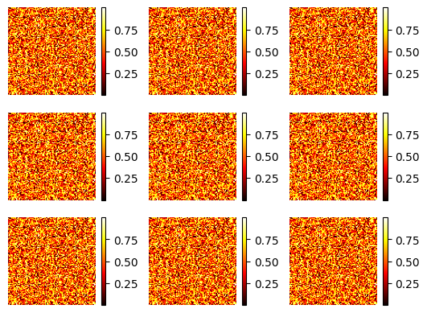
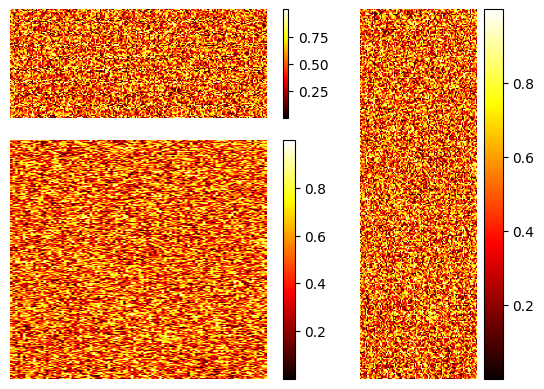

# subplots 
{:.no_toc}

<nav markdown="1" class="toc-class">
* TOC
{:toc}
</nav>

## Top

Questions to [David Rotermund](mailto:davrot@uni-bremen.de)


## Example 1 (2d regular grid)

```python
import numpy as np
import matplotlib.pylab as plt

rng = np.random.default_rng()

a = rng.random((100, 100))

fig, axs = plt.subplots(nrows=3, ncols=3)
print(axs.shape)  # -> (3, 3)

for x in range(0, axs.shape[0]):
    for y in range(0, axs.shape[1]):
        im = axs[x, y].imshow(a, cmap="hot")
        axs[x, y].set_axis_off()
        fig.colorbar(im, ax=axs[x, y], orientation="vertical")
plt.show()
```



## Example 2 (2d)

```python
## Example 1 (2d regular grid)

import numpy as np
import matplotlib.pylab as plt
import matplotlib.gridspec as gridspec

rng = np.random.default_rng()

a = rng.random((100, 200))
b = rng.random((300, 100))
c = rng.random((200, 200))

fig = plt.figure()
gs = gridspec.GridSpec(3, 3)


ax1 = plt.subplot(gs[0, 0:2])
im = ax1.imshow(a, cmap="hot", aspect="auto")
ax1.set_axis_off()
fig.colorbar(im, ax=ax1, orientation="vertical")

ax2 = plt.subplot(gs[0:3, 2])
im = ax2.imshow(b, cmap="hot", aspect="auto")
ax2.set_axis_off()
fig.colorbar(im, ax=ax2, orientation="vertical")

ax3 = plt.subplot(gs[1:3, 0:2])
im = ax3.imshow(b, cmap="hot", aspect="auto")
ax3.set_axis_off()
fig.colorbar(im, ax=ax3, orientation="vertical")

plt.show()
```




## [matplotlib.pyplot.subplots](https://matplotlib.org/stable/api/_as_gen/matplotlib.pyplot.subplots.html#matplotlib.pyplot.subplots)

```python
matplotlib.pyplot.subplots(nrows=1, ncols=1, *, sharex=False, sharey=False, squeeze=True, width_ratios=None, height_ratios=None, subplot_kw=None, gridspec_kw=None, **fig_kw)
```

> Create a figure and a set of subplots.
> 
> This utility wrapper makes it convenient to create common layouts of subplots, including the enclosing figure object, in a single call.

> **nrows**, **ncols** : int, default: 1
> 
> Number of rows/columns of the subplot grid.


## [matplotlib.axes.Axes.imshow](https://matplotlib.org/stable/api/_as_gen/matplotlib.axes.Axes.imshow.html)

```python
Axes.imshow(X, cmap=None, norm=None, *, aspect=None, interpolation=None, alpha=None, vmin=None, vmax=None, origin=None, extent=None, interpolation_stage=None, filternorm=True, filterrad=4.0, resample=None, url=None, data=None, **kwargs)[source]
```

> Display data as an image, i.e., on a 2D regular raster.
> 
> The input may either be actual RGB(A) data, or 2D scalar data, which will be rendered as a pseudocolor image. For displaying a grayscale image, set up the colormapping using the parameters cmap='gray', vmin=0, vmax=255.
> 
> The number of pixels used to render an image is set by the Axes size and the figure dpi. This can lead to aliasing artifacts when the image is resampled, because the displayed image size will usually not match the size of X (see Image antialiasing). The resampling can be controlled via the interpolation parameter and/or rcParams["image.interpolation"] (default: 'antialiased').

## [matplotlib.axes.Axes.set_axis_off](https://matplotlib.org/stable/api/_as_gen/matplotlib.axes.Axes.set_axis_off.html#matplotlib-axes-axes-set-axis-off)

```python
Axes.set_axis_off()
```

> Hide all visual components of the x- and y-axis.
> 
> This sets a flag to suppress drawing of all axis decorations, i.e. axis labels, axis spines, and the axis tick component (tick markers, tick labels, and grid lines). Individual visibility settings of these components are ignored as long as set_axis_off() is in effect.


## [matplotlib.axes.Axes.set_axis_on](https://matplotlib.org/stable/api/_as_gen/matplotlib.axes.Axes.set_axis_on.html#matplotlib.axes.Axes.set_axis_on)

```python
Axes.set_axis_on()
```

> Do not hide all visual components of the x- and y-axis.
> 
> This reverts the effect of a prior set_axis_off() call. Whether the individual axis decorations are drawn is controlled by their respective visibility settings.
> 
> This is on by default.

## [matplotlib.axes.Axes.set_xlim](https://matplotlib.org/stable/api/_as_gen/matplotlib.axes.Axes.set_xlim.html#matplotlib.axes.Axes.set_xlim)

```python
Axes.set_xlim(left=None, right=None, *, emit=True, auto=False, xmin=None, xmax=None)
```

> Set the y-axis view limits.

## [matplotlib.axes.Axes.set_ylim](https://matplotlib.org/stable/api/_as_gen/matplotlib.axes.Axes.set_ylim.html#matplotlib.axes.Axes.set_ylim)

```python
Axes.set_ylim(bottom=None, top=None, *, emit=True, auto=False, ymin=None, ymax=None)
```

> Set the y-axis view limits.

## [matplotlib.axes.Axes.set_xlabel](https://matplotlib.org/stable/api/_as_gen/matplotlib.axes.Axes.set_xlabel.html#matplotlib.axes.Axes.set_xlabel)

```python
Axes.set_xlabel(xlabel, fontdict=None, labelpad=None, *, loc=None, **kwargs)
```

> Set the label for the x-axis.

## [matplotlib.axes.Axes.set_ylabel](https://matplotlib.org/stable/api/_as_gen/matplotlib.axes.Axes.set_ylabel.html#matplotlib.axes.Axes.set_ylabel)

```python
Axes.set_ylabel(ylabel, fontdict=None, labelpad=None, *, loc=None, **kwargs)
```

> Set the label for the y-axis.

## [matplotlib.axes.Axes.set_title](https://matplotlib.org/stable/api/_as_gen/matplotlib.axes.Axes.set_title.html#matplotlib.axes.Axes.set_title)

```python
Axes.set_title(label, fontdict=None, loc=None, pad=None, *, y=None, **kwargs)[source]
```

> Set a title for the Axes.
> 
> Set one of the three available Axes titles. The available titles are positioned above the Axes in the center, flush with the left edge, and flush with the right edge.

## [matplotlib.axes.Axes.legend](https://matplotlib.org/stable/api/_as_gen/matplotlib.axes.Axes.legend.html#matplotlib.axes.Axes.legend)

```python
Axes.legend(*args, **kwargs)
```

> Place a legend on the Axes.

## [matplotlib.axes.Axes.plot](https://matplotlib.org/stable/api/_as_gen/matplotlib.axes.Axes.plot.html#matplotlib-axes-axes-plot)

```python
Axes.plot(*args, scalex=True, scaley=True, data=None, **kwargs)
```

> Plot y versus x as lines and/or markers.

## [matplotlib.axes.Axes.loglog](https://matplotlib.org/stable/api/_as_gen/matplotlib.axes.Axes.loglog.html#matplotlib.axes.Axes.loglog)

```python
Axes.loglog(*args, **kwargs)
```

> Make a plot with log scaling on both the x- and y-axis.

## [matplotlib.axes.Axes.semilogx](https://matplotlib.org/stable/api/_as_gen/matplotlib.axes.Axes.semilogx.html#matplotlib-axes-axes-semilogx)

```python
Axes.semilogx(*args, **kwargs)
```

> Make a plot with log scaling on the x-axis.

## [matplotlib.axes.Axes.semilogy](https://matplotlib.org/stable/api/_as_gen/matplotlib.axes.Axes.semilogy.html#matplotlib.axes.Axes.semilogy)

```python
Axes.semilogy(*args, **kwargs)
```

> Make a plot with log scaling on the y-axis.


