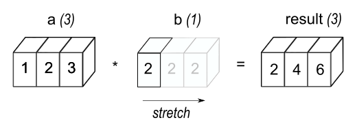
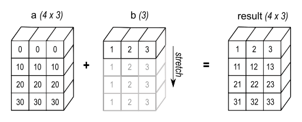
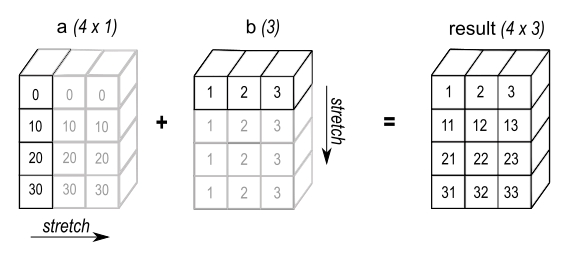

# [Broadcasting](https://numpy.org/devdocs/user/basics.broadcasting.html)
{:.no_toc}

<nav markdown="1" class="toc-class">
* TOC
{:toc}
</nav>

## The goal

Broadcasting: Automatic adaption of dimensions​

Questions to [David Rotermund](mailto:davrot@uni-bremen.de)

## [General broadcasting rules](https://numpy.org/devdocs/user/basics.broadcasting.html)

> When operating on two arrays, NumPy compares their shapes element-wise. It starts with the trailing (i.e. rightmost) dimension and works its way left. **Two dimensions are compatible when**
> 
> * **they are equal**, or
> * **one of them is 1**.
> 
> If these conditions are not met, a ValueError: operands could not be broadcast together exception is thrown, indicating that the arrays have incompatible shapes.
> 
> **Input arrays do not need to have the same number of dimensions**. **The resulting array will have the same number of dimensions as the input array with the greatest number of dimensions**, where the size of each dimension is the largest size of the corresponding dimension among the input arrays. Note that missing dimensions are assumed to have size one.

Figure 1 (from [numpy.org](https://numpy.org/devdocs/user/basics.broadcasting.html)) : In the simplest example of broadcasting, the scalar b is stretched to become an array of same shape as a so the shapes are compatible for element-by-element multiplication.

Figure 2 (from [numpy.org](https://numpy.org/devdocs/user/basics.broadcasting.html)) : A one dimensional array added to a two dimensional array results in broadcasting if number of 1-d array elements matches the number of 2-d array columns.

Figure 3 (from [numpy.org](https://numpy.org/devdocs/user/basics.broadcasting.html)) : When the trailing dimensions of the arrays are unequal, broadcasting fails because it is impossible to align the values in the rows of the 1st array with the elements of the 2nd arrays for element-by-element addition.

Figure 4 (from [numpy.org](https://numpy.org/devdocs/user/basics.broadcasting.html)) : In some cases, broadcasting stretches both arrays to form an output array larger than either of the initial arrays.

