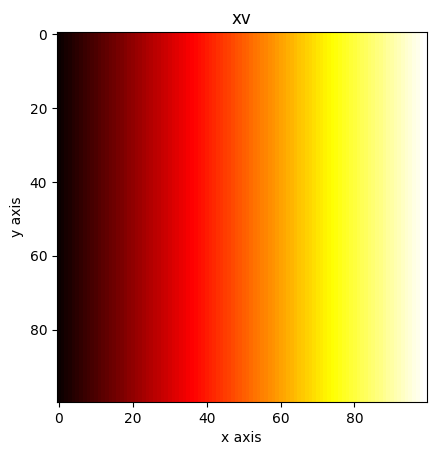

# Meshgrid
{:.no_toc}

<nav markdown="1" class="toc-class">
* TOC
{:toc}
</nav>

## The goal


Questions to [David Rotermund](mailto:davrot@uni-bremen.de)

## [numpy.meshgrid](https://numpy.org/doc/stable/reference/generated/numpy.meshgrid.html)


```python
numpy.meshgrid(*xi, copy=True, sparse=False, indexing='xy')
```

> Return a list of coordinate matrices from coordinate vectors.
> 
> Make N-D coordinate arrays for vectorized evaluations of N-D scalar/vector fields over N-D grids, given one-dimensional coordinate arrays x1, x2,…, xn.

```python
import numpy as np
import matplotlib.pyplot as plt

x = np.linspace(0, 1, 100)
y = np.linspace(0, 1, 100)

xv, yv = np.meshgrid(x, y)

plt.imshow(xv, cmap="hot")
plt.xlabel("x axis")
plt.ylabel("y axis")
plt.title("xv")
plt.show()

plt.imshow(yv, cmap="hot")
plt.xlabel("x axis")
plt.ylabel("y axis")
plt.title("yv")
plt.show()
```




An example:

```python
import numpy as np
import matplotlib.pyplot as plt

x = np.linspace(0, 1, 100)
y = np.linspace(0, 1, 100)

xv, yv = np.meshgrid(x, y)

a = np.sin(xv * 2 * np.pi) * np.sin(yv * 8 * np.pi)

plt.imshow(a, cmap="hot")
plt.xlabel("x axis")
plt.ylabel("y axis")
plt.show()
```


**The question is if you really need a mesh or if just using broadcasting can do the job too.** I guess this depends on your need.

```python
import numpy as np
import matplotlib.pyplot as plt

x = np.linspace(0, 1, 100)[np.newaxis, :]
y = np.linspace(0, 1, 100)[:, np.newaxis]

a = np.sin(x * 2 * np.pi) * np.sin(y * 8 * np.pi)

plt.imshow(a, cmap="hot")
plt.xlabel("x axis")
plt.ylabel("y axis")
plt.show()
```


## [numpy.mgrid](https://numpy.org/doc/stable/reference/generated/numpy.mgrid.html) (dense meshgrid)

{: .topic-optional}
This is an optional topic!

```python
numpy.mgrid = <numpy.lib.index_tricks.MGridClass object>
```

> An instance which returns a dense multi-dimensional “meshgrid”.
> 
> An instance which returns a dense (or fleshed out) mesh-grid when indexed, so that each returned argument has the same shape. The dimensions and number of the output arrays are equal to the number of indexing dimensions. If the step length is not a complex number, then the stop is not inclusive.
> 
> However, if the step length is a complex number (e.g. 5j), then the integer part of its magnitude is interpreted as specifying the number of points to create between the start and stop values, where the stop value is inclusive.

```python
import numpy as np

xv, yv = np.mgrid[0:5, 0:5]

print(xv)
print()
print(yv)
```

Output: 

```python
[[0 0 0 0 0]
 [1 1 1 1 1]
 [2 2 2 2 2]
 [3 3 3 3 3]
 [4 4 4 4 4]]

[[0 1 2 3 4]
 [0 1 2 3 4]
 [0 1 2 3 4]
 [0 1 2 3 4]
 [0 1 2 3 4]]
```

```python
import numpy as np

xv, yv = np.mgrid[0:5:0.25, 0:5:0.5]

print(xv)
print()
print(yv)
```

Output:

```python
[[0.   0.   0.   0.   0.   0.   0.   0.   0.   0.  ]
 [0.25 0.25 0.25 0.25 0.25 0.25 0.25 0.25 0.25 0.25]
 [0.5  0.5  0.5  0.5  0.5  0.5  0.5  0.5  0.5  0.5 ]
 [0.75 0.75 0.75 0.75 0.75 0.75 0.75 0.75 0.75 0.75]
 [1.   1.   1.   1.   1.   1.   1.   1.   1.   1.  ]
 [1.25 1.25 1.25 1.25 1.25 1.25 1.25 1.25 1.25 1.25]
 [1.5  1.5  1.5  1.5  1.5  1.5  1.5  1.5  1.5  1.5 ]
 [1.75 1.75 1.75 1.75 1.75 1.75 1.75 1.75 1.75 1.75]
 [2.   2.   2.   2.   2.   2.   2.   2.   2.   2.  ]
 [2.25 2.25 2.25 2.25 2.25 2.25 2.25 2.25 2.25 2.25]
 [2.5  2.5  2.5  2.5  2.5  2.5  2.5  2.5  2.5  2.5 ]
 [2.75 2.75 2.75 2.75 2.75 2.75 2.75 2.75 2.75 2.75]
 [3.   3.   3.   3.   3.   3.   3.   3.   3.   3.  ]
 [3.25 3.25 3.25 3.25 3.25 3.25 3.25 3.25 3.25 3.25]
 [3.5  3.5  3.5  3.5  3.5  3.5  3.5  3.5  3.5  3.5 ]
 [3.75 3.75 3.75 3.75 3.75 3.75 3.75 3.75 3.75 3.75]
 [4.   4.   4.   4.   4.   4.   4.   4.   4.   4.  ]
 [4.25 4.25 4.25 4.25 4.25 4.25 4.25 4.25 4.25 4.25]
 [4.5  4.5  4.5  4.5  4.5  4.5  4.5  4.5  4.5  4.5 ]
 [4.75 4.75 4.75 4.75 4.75 4.75 4.75 4.75 4.75 4.75]]

[[0.  0.5 1.  1.5 2.  2.5 3.  3.5 4.  4.5]
 [0.  0.5 1.  1.5 2.  2.5 3.  3.5 4.  4.5]
 [0.  0.5 1.  1.5 2.  2.5 3.  3.5 4.  4.5]
 [0.  0.5 1.  1.5 2.  2.5 3.  3.5 4.  4.5]
 [0.  0.5 1.  1.5 2.  2.5 3.  3.5 4.  4.5]
 [0.  0.5 1.  1.5 2.  2.5 3.  3.5 4.  4.5]
 [0.  0.5 1.  1.5 2.  2.5 3.  3.5 4.  4.5]
 [0.  0.5 1.  1.5 2.  2.5 3.  3.5 4.  4.5]
 [0.  0.5 1.  1.5 2.  2.5 3.  3.5 4.  4.5]
 [0.  0.5 1.  1.5 2.  2.5 3.  3.5 4.  4.5]
 [0.  0.5 1.  1.5 2.  2.5 3.  3.5 4.  4.5]
 [0.  0.5 1.  1.5 2.  2.5 3.  3.5 4.  4.5]
 [0.  0.5 1.  1.5 2.  2.5 3.  3.5 4.  4.5]
 [0.  0.5 1.  1.5 2.  2.5 3.  3.5 4.  4.5]
 [0.  0.5 1.  1.5 2.  2.5 3.  3.5 4.  4.5]
 [0.  0.5 1.  1.5 2.  2.5 3.  3.5 4.  4.5]
 [0.  0.5 1.  1.5 2.  2.5 3.  3.5 4.  4.5]
 [0.  0.5 1.  1.5 2.  2.5 3.  3.5 4.  4.5]
 [0.  0.5 1.  1.5 2.  2.5 3.  3.5 4.  4.5]
 [0.  0.5 1.  1.5 2.  2.5 3.  3.5 4.  4.5]]
```
