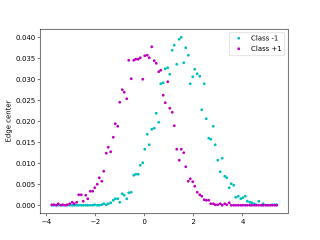

# ROC
{:.no_toc}

<nav markdown="1" class="toc-class">
* TOC
{:toc}
</nav>

## Top

Questions to [David Rotermund](mailto:davrot@uni-bremen.de)

The following code is for the case where the amount of data for both classes is the same. 

## Test data

```python
import numpy as np
import matplotlib.pyplot as plt

rng = np.random.default_rng(1)

a_x = rng.normal(1.5, 1.0, size=(5000))
b_x = rng.normal(0.0, 1.0, size=(5000))


ab_x = np.concatenate([a_x, b_x])
edges = np.histogram_bin_edges(ab_x, bins=100, range=None, weights=None)

h_a, _ = np.histogram(a_x, bins=edges)
h_b, _ = np.histogram(b_x, bins=edges)

h_a = h_a.astype(np.float32)
h_b = h_b.astype(np.float32)

h_a /= h_a.sum()
h_b /= h_b.sum()

edges = (edges[1:] + edges[:-1]) / 2.0

plt.plot(edges, h_a, "c.", label="Class -1")
plt.plot(edges, h_b, "m.", label="Class +1")
plt.ylabel("Probability of a value")
plt.ylabel("Edge center")
plt.legend()
plt.show()
```



## Find the cumsum maximum

```python
import numpy as np
import matplotlib.pyplot as plt

rng = np.random.default_rng(1)

a_x = rng.normal(1.5, 1.0, size=(5000))
b_x = rng.normal(0.0, 1.0, size=(5000))

data_data = np.concatenate([a_x, b_x])
data_class = np.concatenate(
    [np.full_like(a_x, -1 / a_x.shape[0]), np.full_like(b_x, +1 / b_x.shape[0])]
)
idx = np.argsort(data_data)

data_data = data_data[idx]
data_class = data_class[idx]

data_cumsum = np.cumsum(data_class)

plt.plot(data_cumsum)
plt.plot(
    [np.argmax(data_cumsum), np.argmax(data_cumsum)], [0, np.max(data_cumsum)], "k--"
)
plt.ylabel("Cumsum of the classes")
plt.xlabel("Sorted sample id")
plt.show()
```


## How to create an estimate from the ROC cumsum maximum

```python
import numpy as np
import matplotlib.pyplot as plt

rng = np.random.default_rng(1)

a_x = rng.normal(1.5, 1.0, size=(5000))
b_x = rng.normal(0.0, 1.0, size=(5000))

data_data = np.concatenate([a_x, b_x])
data_class = np.concatenate(
    [np.full_like(a_x, -1 / a_x.shape[0]), np.full_like(b_x, +1 / b_x.shape[0])]
)
data_class_id = np.concatenate([np.full_like(a_x, -1), np.full_like(b_x, +1)])
idx = np.argsort(data_data)

data_data = data_data[idx]
data_class = data_class[idx]
data_class_id = data_class_id[idx]

data_cumsum = np.cumsum(data_class)
border = np.argmax(np.abs(data_cumsum))

if data_cumsum[border] < 0:
    estimate = np.concatenate(
        (
            np.full_like(data_class[: border + 1], -1),
            np.full_like(data_class[border + 1 :], +1),
        )
    )

else:
    estimate = np.concatenate(
        (
            np.full_like(data_class[: border + 1], +1),
            np.full_like(data_class[border + 1 :], -1),
        )
    )


performance = 100.0 * (data_class_id == estimate).sum() / data_class_id.shape[0]
print(f"Performance: {performance}% correct")

plt.subplot(2, 1, 1)
idx_a = np.where(data_class < 0)[0]
idx_b = np.where(data_class > 0)[0]
idx = np.arange(0, data_class.shape[0])

plt.plot(data_data[idx_a], np.zeros_like(idx_a), "c*")
plt.plot(data_data[idx_b], np.zeros_like(idx_b), "m.")
plt.yticks([])
plt.title("Data")

plt.subplot(2, 1, 2)
idx_a = np.where(estimate < 0)[0]
idx_b = np.where(estimate > 0)[0]
idx = np.arange(0, estimate.shape[0])

plt.plot(data_data[idx_a], np.zeros_like(idx_a), "c*")
plt.plot(data_data[idx_b], np.zeros_like(idx_b), "m.")
plt.yticks([])
plt.title("Estimate")
plt.xlabel("Data Value")
plt.show()
```

Output:
```python
Performance: 77.31% correct
```


