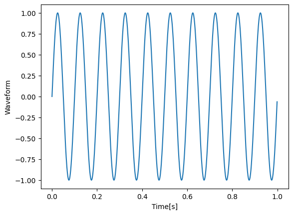
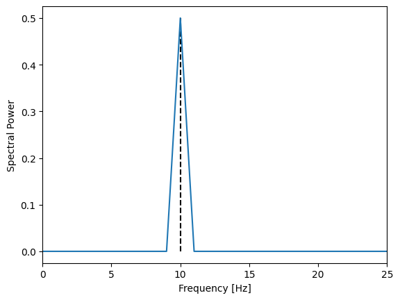

# Numpy -- rfft and spectral power
{:.no_toc}

<nav markdown="1" class="toc-class">
* TOC
{:toc}
</nav>

## Goal
We want to calculate a well behaved power spectral density from a 1 dimensional time series. 

Questions to [David Rotermund](mailto:davrot@uni-bremen.de)

## Generation of test data 
We will generate a sine wave with 10 Hz.

```python
import numpy as np

time_series_length: int = 1000
dt: float = 1.0 / 1000.0  # time resolution is 1ms
sampling_frequency: float = 1.0 / dt
frequency_hz: float = 10.0
t: np.ndarray = np.arange(0, time_series_length) * dt
y: np.ndarray = np.sin(t * 2 * np.pi * frequency_hz)
```



## Fourier transform with rfft

Since we deal with non-complex waveforms (i.e. only real values) we should use rfft. This is faster and uses less memory. 

### 1 dimension


| | |
| ------------- |:-------------:|
| [numpy.fft.rfft](https://numpy.org/doc/stable/reference/generated/numpy.fft.rfft.html) |  Compute the one-dimensional discrete Fourier Transform for real input. |
| [numpy.fft.irfft](https://numpy.org/doc/stable/reference/generated/numpy.fft.irfft.html) |  Computes the inverse of [rfft](https://numpy.org/doc/stable/reference/generated/numpy.fft.rfft.html#numpy.fft.rfft). |
| [numpy.fft.rfftfreq](https://numpy.org/doc/stable/reference/generated/numpy.fft.rfftfreq.html) |  Return the Discrete Fourier Transform sample frequencies (for usage with rfft, irfft). |

### 2 dimensions

| | |
| ------------- |:-------------:|
| [numpy.fft.rfft2](https://numpy.org/doc/stable/reference/generated/numpy.fft.rfft2.html) |  Compute the 2-dimensional FFT of a real array. |
| [numpy.fft.irfft2](https://numpy.org/doc/stable/reference/generated/numpy.fft.irfft2.html) |  Computes the inverse of rfft2. |

### N dimensions

| | |
| ------------- |:-------------:|
| [numpy.fft.rfftn](https://numpy.org/doc/stable/reference/generated/numpy.fft.rfftn.html) | Compute the N-dimensional discrete Fourier Transform for real input.
| [numpy.fft.irfftn](https://numpy.org/doc/stable/reference/generated/numpy.fft.irfftn.html) | Computes the inverse of rfftn.


Since we deal with a 1 dimensional time series

```python
y_fft: np.ndarray = np.fft.rfft(y)
frequency_axis: np.ndarray = np.fft.rfftfreq(y.shape[0]) * sampling_frequency
```

## Calculating a [normalized](https://de.mathworks.com/help/signal/ug/power-spectral-density-estimates-using-fft.html) power spectral density

The goal is to produce a power spectral density that is compatible with the [Parseval's identity](https://en.wikipedia.org/wiki/Parseval%27s_identity). Or in other words: the sum over the power spectrum without the zero frequency has the same value as the variance of the time series.  

```python
y_power: np.ndarray = (1 / (sampling_frequency * y.shape[0])) * np.abs(y_fft) ** 2
y_power[1:-2] *= 2

if frequency_axis[-1] != (sampling_frequency / 2.0):
    y_power[-1] *= 2
```

Check of the normalization:

```python
print(y_power[1:].sum())  # -> 0.5
print(np.var(y))  # -> 0.5
```


Or zoomed in:



