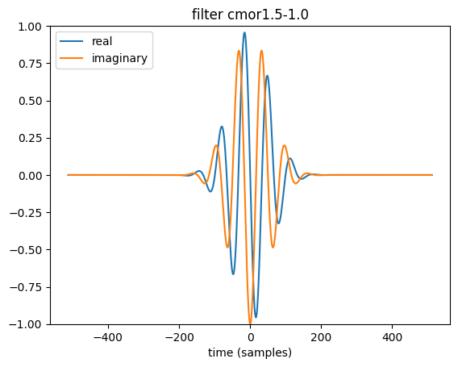

# [PyWavelets](https://pywavelets.readthedocs.io/en/latest/) -- Wavelet Transforms in Python
## The goal
How do we do wavelet transforms under Python?

Questions to [David Rotermund](mailto:davrot@uni-bremen.de)

You might want to read: [A Practical Guide to Wavelet Analysis](https://paos.colorado.edu/research/wavelets/)  ->  [PDF](https://paos.colorado.edu/research/wavelets/bams_79_01_0061.pdf)

```shell
pip install PyWavelets
```

## Which [continuous mother wavelets](https://pywavelets.readthedocs.io/en/latest/ref/cwt.html#continuous-wavelet-families) are available?

```python
import pywt

wavelet_list = pywt.wavelist(kind="continuous")
print(wavelet_list)
```

```Python console
['cgau1', 'cgau2', 'cgau3', 'cgau4', 'cgau5', 'cgau6', 'cgau7', 'cgau8', 'cmor', 'fbsp', 'gaus1', 'gaus2', 'gaus3', 'gaus4', 'gaus5', 'gaus6', 'gaus7', 'gaus8', 'mexh', 'morl', 'shan']
```

* The mexican hat wavelet "mexh" 
* The Morlet wavelet "morl"
* The complex Morlet wavelet ("cmorB-C" with floating point values B, C) 
* The Gaussian wavelets ("gausP" where P is an integer between 1 and and 8)
* The complex Gaussian wavelets ("cgauP" where P is an integer between 1 and 8)
* The Shannon wavelets ("shanB-C" with floating point values B and C)
* The frequency B-spline wavelets ("fpspM-B-C" with integer M and floating point B, C)

see [Choosing the scales for cwt](https://pywavelets.readthedocs.io/en/latest/ref/cwt.html#choosing-the-scales-for-cwt)

## Visualizing wavelets

```python
import numpy as np
import matplotlib.pyplot as plt
import pywt

wavelet_name: str = "cmor1.5-1.0"

# Invoking the complex morlet wavelet object
wav = pywt.ContinuousWavelet(wavelet_name)

# Integrate psi wavelet function from -Inf to x
# using the rectangle integration method.
int_psi, x = pywt.integrate_wavelet(wav, precision=10)
int_psi /= np.abs(int_psi).max()
wav_filter: np.ndarray = int_psi[::-1]

nt: int = len(wav_filter)
t: np.ndarray = np.linspace(-nt // 2, nt // 2, nt)
plt.plot(t, wav_filter.real, label="real")
plt.plot(t, wav_filter.imag, label="imaginary")
plt.ylim([-1, 1])
plt.legend(loc="upper left")
plt.xlabel("time (samples)")
plt.title(f"filter {wavelet_name}")
```



## Building a frequency scale for the complex Morlet wavelet

We don't want to waste computations power. Thus we want to put the frequency band for higher frequencies further away than for smaller frequencies. Thus we will use a $2^{N \cdot Scale}$ scale.

```python
import numpy as np
import matplotlib.pyplot as plt
import pywt

number_of_frequences: int = 20  # Number of frequency bands
frequency_range: tuple[float, float] = (2, 200)  # Hz
dt: float = 1 / 1000  # sec

frequency_range_np: np.ndarray = np.array(frequency_range)

s_spacing = (1.0 / (number_of_frequences - 1)) * np.log2(
    frequency_range_np.max() / frequency_range_np.min()
)
scale = np.power(2, np.arange(0, number_of_frequences) * s_spacing)

frequency_axis_np = frequency_range_np.min() * np.flip(scale)
plt.plot(frequency_axis_np, "--*", label="Frequency we want")

wave_scales = 1.0 / (frequency_axis_np * dt)

frequency_axis = pywt.scale2frequency("cmor1.5-1.0", wave_scales) / dt

plt.plot(frequency_axis, ".", label="Frequency we got")
plt.legend()
plt.xlim([0, number_of_frequences - 1])
plt.xticks(np.arange(0, number_of_frequences))
plt.ylabel("Frequency [Hz]")
plt.xlabel("Frequency band")
plt.show()
```


## Cone of influence for the complex Morlet wavelet

At the edges of the time series, the wavelet is dangling out of the allowed time axis. Thus these values are nonsense and need to be removed. The size of the wavelet is connected to its scale, hence for different scales the bad zone has different sizes. For the complex Morlet wavelet the number of samples are defined by the equation $\sqrt(2) \cdot scale$ ( [A Practical Guide to Wavelet Analysis](https://paos.colorado.edu/research/wavelets/)  ->  [PDF](https://paos.colorado.edu/research/wavelets/bams_79_01_0061.pdf) ). Which looks like this: 

```python
cone_of_influence = np.ceil(np.sqrt(2) * wave_scales).astype(dtype=np.int64)
print(cone_of_influence)
plt.plot(frequency_axis, cone_of_influence, "*")
plt.ylabel("Number of invalid data samples")
plt.xlabel("Frequency [Hz]")
plt.show()
```

``python console
[  8  10  12  15  19  24  31  39  50  63  80 102 130 166 211 269 342 436
 555 708]
```


