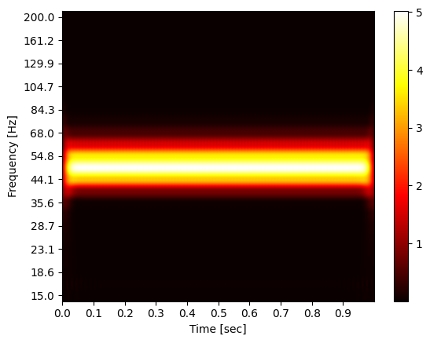
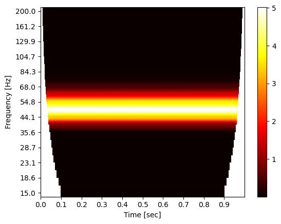

# [PyWavelets](https://pywavelets.readthedocs.io/en/latest/) : Wavelet Transforms in Python
{:.no_toc}

* TOC
{:toc}

## The goal
How do we do wavelet transforms under Python?

Questions to [David Rotermund](mailto:davrot@uni-bremen.de)

You might want to read: [A Practical Guide to Wavelet Analysis](https://paos.colorado.edu/research/wavelets/)  ->  [PDF](https://paos.colorado.edu/research/wavelets/bams_79_01_0061.pdf)

```shell
pip install PyWavelets
```

## Which [continuous mother wavelets](https://pywavelets.readthedocs.io/en/latest/ref/cwt.html#continuous-wavelet-families) are available?

```python
import pywt

wavelet_list = pywt.wavelist(kind="continuous")
print(wavelet_list)
```

```python
['cgau1', 'cgau2', 'cgau3', 'cgau4', 'cgau5', 'cgau6', 'cgau7', 'cgau8', 'cmor', 'fbsp', 'gaus1', 'gaus2', 'gaus3', 'gaus4', 'gaus5', 'gaus6', 'gaus7', 'gaus8', 'mexh', 'morl', 'shan']
```

* The mexican hat wavelet "mexh" 
* The Morlet wavelet "morl"
* The complex Morlet wavelet ("cmorB-C" with floating point values B, C) 
* The Gaussian wavelets ("gausP" where P is an integer between 1 and and 8)
* The complex Gaussian wavelets ("cgauP" where P is an integer between 1 and 8)
* The Shannon wavelets ("shanB-C" with floating point values B and C)
* The frequency B-spline wavelets ("fpspM-B-C" with integer M and floating point B, C)

see [Choosing the scales for cwt](https://pywavelets.readthedocs.io/en/latest/ref/cwt.html#choosing-the-scales-for-cwt)

## Visualizing wavelets

```python
import numpy as np
import matplotlib.pyplot as plt
import pywt

wavelet_name: str = "cmor1.5-1.0"

# Invoking the complex morlet wavelet object
wav = pywt.ContinuousWavelet(wavelet_name)

# Integrate psi wavelet function from -Inf to x
# using the rectangle integration method.
int_psi, x = pywt.integrate_wavelet(wav, precision=10)
int_psi /= np.abs(int_psi).max()
wav_filter: np.ndarray = int_psi[::-1]

nt: int = len(wav_filter)
t: np.ndarray = np.linspace(-nt // 2, nt // 2, nt)
plt.plot(t, wav_filter.real, label="real")
plt.plot(t, wav_filter.imag, label="imaginary")
plt.ylim([-1, 1])
plt.legend(loc="upper left")
plt.xlabel("time (samples)")
plt.title(f"filter {wavelet_name}")
```


## Building a frequency scale for the complex Morlet wavelet

We don't want to waste computations power. Thus we want to put the frequency band for higher frequencies further away than for smaller frequencies. Thus we will use a $2^{N \cdot Scale}$ scale.

```python
import numpy as np
import matplotlib.pyplot as plt
import pywt

number_of_frequences: int = 20  # Number of frequency bands
frequency_range: tuple[float, float] = (2, 200)  # Hz
dt: float = 1 / 1000  # sec

frequency_range_np: np.ndarray = np.array(frequency_range)

s_spacing = (1.0 / (number_of_frequences - 1)) * np.log2(
    frequency_range_np.max() / frequency_range_np.min()
)
scale = np.power(2, np.arange(0, number_of_frequences) * s_spacing)

frequency_axis_np = frequency_range_np.min() * np.flip(scale)
plt.plot(frequency_axis_np, "--*", label="Frequency we want")

wave_scales = 1.0 / (frequency_axis_np * dt)

frequency_axis = pywt.scale2frequency("cmor1.5-1.0", wave_scales) / dt

plt.plot(frequency_axis, ".", label="Frequency we got")
plt.legend()
plt.xlim([0, number_of_frequences - 1])
plt.xticks(np.arange(0, number_of_frequences))
plt.ylabel("Frequency [Hz]")
plt.xlabel("Frequency band")
plt.show()
```


## Cone of influence for the complex Morlet wavelet

At the edges of the time series, the wavelet is dangling out of the allowed time axis. Thus these values are nonsense and need to be removed. The size of the wavelet is connected to its scale, hence for different scales the bad zone has different sizes. For the complex Morlet wavelet the number of samples are defined by the equation $\sqrt(2) \cdot scale$ ( [A Practical Guide to Wavelet Analysis](https://paos.colorado.edu/research/wavelets/)  ->  [PDF](https://paos.colorado.edu/research/wavelets/bams_79_01_0061.pdf) ). Which looks like this: 

```python
cone_of_influence = np.ceil(np.sqrt(2) * wave_scales).astype(dtype=np.int64)
print(cone_of_influence)
plt.plot(frequency_axis, cone_of_influence, "*")
plt.ylabel("Number of invalid data samples")
plt.xlabel("Frequency [Hz]")
plt.show()
```

```python
[  8  10  12  15  19  24  31  39  50  63  80 102 130 166 211 269 342 436 555 708]
```


## Analyzing a test signal 
First we need a test signal. We will use a 50Hz sinus for that
```python
import numpy as np
import matplotlib.pyplot as plt

f_test: float = 50  # Hz
number_of_test_samples: int = 1000
dt: float = 1.0 / 1000  # sec

t_test: np.ndarray = np.arange(0, number_of_test_samples) * dt
test_data: np.ndarray = np.sin(2 * np.pi * f_test * t_test)

plt.plot(t_test, test_data)
plt.xlabel("time [sec]")
plt.ylabel("time series")
```


```python
import numpy as np
import matplotlib.pyplot as plt
import pywt

# Calculate the wavelet scales we requested
def calculate_wavelet_scale(
    number_of_frequences: int,
    frequency_range_min: float,
    frequency_range_max: float,
    dt: float,
) -> np.ndarray:
    s_spacing: np.ndarray = (1.0 / (number_of_frequences - 1)) * np.log2(
        frequency_range_max / frequency_range_min
    )
    scale: np.ndarray = np.power(2, np.arange(0, number_of_frequences) * s_spacing)
    frequency_axis_request: np.ndarray = frequency_range_min * np.flip(scale)
    return 1.0 / (frequency_axis_request * dt)


f_test: float = 50  # Hz
number_of_test_samples: int = 1000

# The wavelet we want to use
mother = pywt.ContinuousWavelet("cmor1.5-1.0")

# Parameters for the wavelet transform
number_of_frequences: int = 25  # frequency bands
frequency_range_min: float = 15  # Hz
frequency_range_max: float = 200  # Hz
dt: float = 1.0 / 1000  # sec

t_test: np.ndarray = np.arange(0, number_of_test_samples) * dt
test_data: np.ndarray = np.sin(2 * np.pi * f_test * t_test)

wave_scales = calculate_wavelet_scale(
    number_of_frequences=number_of_frequences,
    frequency_range_min=frequency_range_min,
    frequency_range_max=frequency_range_max,
    dt=dt,
)

complex_spectrum, frequency_axis = pywt.cwt(
    data=test_data, scales=wave_scales, wavelet=mother, sampling_period=dt
)

plt.imshow(abs(complex_spectrum) ** 2, cmap="hot", aspect="auto")
plt.colorbar()

plt.yticks(np.arange(0, frequency_axis.shape[0]), frequency_axis)
plt.xticks(np.arange(0, t_test.shape[0]), t_test)

plt.xlabel("Time [sec]")
plt.ylabel("Frequency [Hz]")
plt.show()
```


**Done** ?!?!

### Fixing the problems -- the axis of the plot 

The axis look horrible! Let us fix that. 

```python
import numpy as np
import matplotlib.pyplot as plt
import pywt


# Calculate the wavelet scales we requested
def calculate_wavelet_scale(
    number_of_frequences: int,
    frequency_range_min: float,
    frequency_range_max: float,
    dt: float,
) -> np.ndarray:
    s_spacing: np.ndarray = (1.0 / (number_of_frequences - 1)) * np.log2(
        frequency_range_max / frequency_range_min
    )
    scale: np.ndarray = np.power(2, np.arange(0, number_of_frequences) * s_spacing)
    frequency_axis_request: np.ndarray = frequency_range_min * np.flip(scale)
    return 1.0 / (frequency_axis_request * dt)


def get_y_ticks(
    reduction_to_ticks: int, frequency_axis: np.ndarray, round: int
) -> tuple[np.ndarray, np.ndarray]:
    output_ticks = np.arange(
        0,
        frequency_axis.shape[0],
        int(np.floor(frequency_axis.shape[0] / reduction_to_ticks)),
    )
    if round < 0:
        output_freq = frequency_axis[output_ticks]
    else:
        output_freq = np.round(frequency_axis[output_ticks], round)
    return output_ticks, output_freq


def get_x_ticks(
    reduction_to_ticks: int, dt: float, number_of_timesteps: int, round: int
) -> tuple[np.ndarray, np.ndarray]:
    time_axis = dt * np.arange(0, number_of_timesteps)
    output_ticks = np.arange(
        0, time_axis.shape[0], int(np.floor(time_axis.shape[0] / reduction_to_ticks))
    )
    if round < 0:
        output_time_axis = time_axis[output_ticks]
    else:
        output_time_axis = np.round(time_axis[output_ticks], round)
    return output_ticks, output_time_axis


f_test: float = 50  # Hz
number_of_test_samples: int = 1000

# The wavelet we want to use
mother = pywt.ContinuousWavelet("cmor1.5-1.0")

# Parameters for the wavelet transform
number_of_frequences: int = 25  # frequency bands
frequency_range_min: float = 15  # Hz
frequency_range_max: float = 200  # Hz
dt: float = 1.0 / 1000  # sec

t_test: np.ndarray = np.arange(0, number_of_test_samples) * dt
test_data: np.ndarray = np.sin(2 * np.pi * f_test * t_test)

wave_scales = calculate_wavelet_scale(
    number_of_frequences=number_of_frequences,
    frequency_range_min=frequency_range_min,
    frequency_range_max=frequency_range_max,
    dt=dt,
)

complex_spectrum, frequency_axis = pywt.cwt(
    data=test_data, scales=wave_scales, wavelet=mother, sampling_period=dt
)

plt.imshow(abs(complex_spectrum) ** 2, cmap="hot", aspect="auto")
plt.colorbar()

y_ticks, y_labels = get_y_ticks(
    reduction_to_ticks=10, frequency_axis=frequency_axis, round=1
)

x_ticks, x_labels = get_x_ticks(
    reduction_to_ticks=10, dt=dt, number_of_timesteps=complex_spectrum.shape[1], round=2
)

plt.yticks(y_ticks, y_labels)
plt.xticks(x_ticks, x_labels)

plt.xlabel("Time [sec]")
plt.ylabel("Frequency [Hz]")
plt.show()
```


This looks already better...

### Fixing the problems -- Cone of influence

If the look at the edges of the 2d plot, we see that the power tapers of. There regions are invalid results because part of the wavelet hangs outside of the time series. The larger the frequency, the larger the region. 

```python
import numpy as np
import matplotlib.pyplot as plt
import pywt


# Calculate the wavelet scales we requested
def calculate_wavelet_scale(
    number_of_frequences: int,
    frequency_range_min: float,
    frequency_range_max: float,
    dt: float,
) -> np.ndarray:
    s_spacing: np.ndarray = (1.0 / (number_of_frequences - 1)) * np.log2(
        frequency_range_max / frequency_range_min
    )
    scale: np.ndarray = np.power(2, np.arange(0, number_of_frequences) * s_spacing)
    frequency_axis_request: np.ndarray = frequency_range_min * np.flip(scale)

    return 1.0 / (frequency_axis_request * dt)


def calculate_cone_of_influence(dt: float, frequency_axis: np.ndarray):
    wave_scales = 1.0 / (frequency_axis * dt)
    cone_of_influence: np.ndarray = np.ceil(np.sqrt(2) * wave_scales).astype(np.int64)
    return cone_of_influence


def get_y_ticks(
    reduction_to_ticks: int, frequency_axis: np.ndarray, round: int
) -> tuple[np.ndarray, np.ndarray]:
    output_ticks = np.arange(
        0,
        frequency_axis.shape[0],
        int(np.floor(frequency_axis.shape[0] / reduction_to_ticks)),
    )
    if round < 0:
        output_freq = frequency_axis[output_ticks]
    else:
        output_freq = np.round(frequency_axis[output_ticks], round)
    return output_ticks, output_freq


def get_x_ticks(
    reduction_to_ticks: int, dt: float, number_of_timesteps: int, round: int
) -> tuple[np.ndarray, np.ndarray]:
    time_axis = dt * np.arange(0, number_of_timesteps)
    output_ticks = np.arange(
        0, time_axis.shape[0], int(np.floor(time_axis.shape[0] / reduction_to_ticks))
    )
    if round < 0:
        output_time_axis = time_axis[output_ticks]
    else:
        output_time_axis = np.round(time_axis[output_ticks], round)
    return output_ticks, output_time_axis


f_test: float = 50  # Hz
number_of_test_samples: int = 1000

# The wavelet we want to use
mother = pywt.ContinuousWavelet("cmor1.5-1.0")

# Parameters for the wavelet transform
number_of_frequences: int = 25  # frequency bands
frequency_range_min: float = 15  # Hz
frequency_range_max: float = 200  # Hz
dt: float = 1.0 / 1000  # sec

t_test: np.ndarray = np.arange(0, number_of_test_samples) * dt
test_data: np.ndarray = np.sin(2 * np.pi * f_test * t_test)

wave_scales = calculate_wavelet_scale(
    number_of_frequences=number_of_frequences,
    frequency_range_min=frequency_range_min,
    frequency_range_max=frequency_range_max,
    dt=dt,
)

complex_spectrum, frequency_axis = pywt.cwt(
    data=test_data, scales=wave_scales, wavelet=mother, sampling_period=dt
)

cone_of_influence = calculate_cone_of_influence(dt, frequency_axis)

plt.imshow(abs(complex_spectrum) ** 2, cmap="hot", aspect="auto")
plt.plot(cone_of_influence, np.arange(0, cone_of_influence.shape[0]), "g")
plt.plot(
    complex_spectrum.shape[1] - 1 - cone_of_influence,
    np.arange(0, cone_of_influence.shape[0]),
    "g",
)
plt.colorbar()

y_ticks, y_labels = get_y_ticks(
    reduction_to_ticks=10, frequency_axis=frequency_axis, round=1
)

x_ticks, x_labels = get_x_ticks(
    reduction_to_ticks=10, dt=dt, number_of_timesteps=complex_spectrum.shape[1], round=2
)

plt.yticks(y_ticks, y_labels)
plt.xticks(x_ticks, x_labels)

plt.xlabel("Time [sec]")
plt.ylabel("Frequency [Hz]")
plt.show()
```


### Fixing the problems -- Cone of influence masked

Instead of marking the invalid regions in the plot, we want to continue to analyze the data later but without the invalide data. Thus we can mask that part of the tranformations with NaNs.


```python
import numpy as np
import matplotlib.pyplot as plt
import pywt


# Calculate the wavelet scales we requested
def calculate_wavelet_scale(
    number_of_frequences: int,
    frequency_range_min: float,
    frequency_range_max: float,
    dt: float,
) -> np.ndarray:
    s_spacing: np.ndarray = (1.0 / (number_of_frequences - 1)) * np.log2(
        frequency_range_max / frequency_range_min
    )
    scale: np.ndarray = np.power(2, np.arange(0, number_of_frequences) * s_spacing)
    frequency_axis_request: np.ndarray = frequency_range_min * np.flip(scale)

    return 1.0 / (frequency_axis_request * dt)


def calculate_cone_of_influence(dt: float, frequency_axis: np.ndarray):
    wave_scales = 1.0 / (frequency_axis * dt)
    cone_of_influence: np.ndarray = np.ceil(np.sqrt(2) * wave_scales).astype(np.int64)
    return cone_of_influence


def get_y_ticks(
    reduction_to_ticks: int, frequency_axis: np.ndarray, round: int
) -> tuple[np.ndarray, np.ndarray]:
    output_ticks = np.arange(
        0,
        frequency_axis.shape[0],
        int(np.floor(frequency_axis.shape[0] / reduction_to_ticks)),
    )
    if round < 0:
        output_freq = frequency_axis[output_ticks]
    else:
        output_freq = np.round(frequency_axis[output_ticks], round)
    return output_ticks, output_freq


def get_x_ticks(
    reduction_to_ticks: int, dt: float, number_of_timesteps: int, round: int
) -> tuple[np.ndarray, np.ndarray]:
    time_axis = dt * np.arange(0, number_of_timesteps)
    output_ticks = np.arange(
        0, time_axis.shape[0], int(np.floor(time_axis.shape[0] / reduction_to_ticks))
    )
    if round < 0:
        output_time_axis = time_axis[output_ticks]
    else:
        output_time_axis = np.round(time_axis[output_ticks], round)
    return output_ticks, output_time_axis


def mask_cone_of_influence(
    complex_spectrum: np.ndarray,
    cone_of_influence: np.ndarray,
    fill_value: float = np.NaN,
) -> np.ndarray:
    assert complex_spectrum.shape[0] == cone_of_influence.shape[0]

    for frequency_id in range(0, cone_of_influence.shape[0]):
        # Front side
        start_id: int = 0
        end_id: int = int(
            np.min((cone_of_influence[frequency_id], complex_spectrum.shape[1]))
        )
        complex_spectrum[frequency_id, start_id:end_id] = fill_value

        start_id = np.max(
            (
                complex_spectrum.shape[1] - cone_of_influence[frequency_id] - 1,
                0,
            )
        )
        end_id = complex_spectrum.shape[1]
        complex_spectrum[frequency_id, start_id:end_id] = fill_value

    return complex_spectrum


f_test: float = 50  # Hz
number_of_test_samples: int = 1000

# The wavelet we want to use
mother = pywt.ContinuousWavelet("cmor1.5-1.0")

# Parameters for the wavelet transform
number_of_frequences: int = 25  # frequency bands
frequency_range_min: float = 15  # Hz
frequency_range_max: float = 200  # Hz
dt: float = 1.0 / 1000  # sec

t_test: np.ndarray = np.arange(0, number_of_test_samples) * dt
test_data: np.ndarray = np.sin(2 * np.pi * f_test * t_test)

wave_scales = calculate_wavelet_scale(
    number_of_frequences=number_of_frequences,
    frequency_range_min=frequency_range_min,
    frequency_range_max=frequency_range_max,
    dt=dt,
)

complex_spectrum, frequency_axis = pywt.cwt(
    data=test_data, scales=wave_scales, wavelet=mother, sampling_period=dt
)

cone_of_influence = calculate_cone_of_influence(dt, frequency_axis)

complex_spectrum = mask_cone_of_influence(
    complex_spectrum=complex_spectrum,
    cone_of_influence=cone_of_influence,
    fill_value=np.NaN,
)

plt.imshow(abs(complex_spectrum) ** 2, cmap="hot", aspect="auto")
plt.colorbar()

y_ticks, y_labels = get_y_ticks(
    reduction_to_ticks=10, frequency_axis=frequency_axis, round=1
)

x_ticks, x_labels = get_x_ticks(
    reduction_to_ticks=10, dt=dt, number_of_timesteps=complex_spectrum.shape[1], round=2
)

plt.yticks(y_ticks, y_labels)
plt.xticks(x_ticks, x_labels)

plt.xlabel("Time [sec]")
plt.ylabel("Frequency [Hz]")
plt.show()
```


