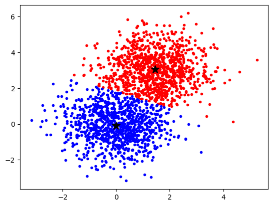
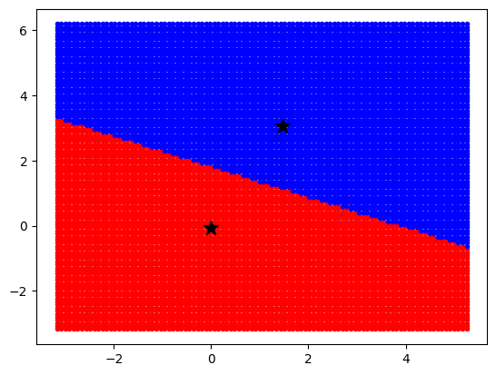

# KMeans
{:.no_toc}

<nav markdown="1" class="toc-class">
* TOC
{:toc}
</nav>

## The goal


Questions to [David Rotermund](mailto:davrot@uni-bremen.de)

## Test data

```python
import numpy as np
import matplotlib.pyplot as plt

rng = np.random.default_rng(1)

rng = np.random.default_rng()

a_x = rng.normal(1.5, 1.0, size=(1000))
a_y = rng.normal(3.0, 1.0, size=(1000))

b_x = rng.normal(0.0, 1.0, size=(1000))
b_y = rng.normal(0.0, 1.0, size=(1000))

plt.plot(a_x, a_y, "c.")
plt.plot(b_x, b_y, "m.")
plt.show()
```


## [sklearn.cluster.KMeans](https://scikit-learn.org/stable/modules/generated/sklearn.cluster.KMeans.html) and its [fit](https://scikit-learn.org/stable/modules/generated/sklearn.cluster.KMeans.html#sklearn.cluster.KMeans.fit)

```python
class sklearn.cluster.KMeans(n_clusters=8, *, init='k-means++', n_init='warn', max_iter=300, tol=0.0001, verbose=0, random_state=None, copy_x=True, algorithm='lloyd')
```

> K-Means clustering.


Attribute:
> **cluster_centers_** : ndarray of shape (n_clusters, n_features)
>    Coordinates of cluster centers. If the algorithm stops before fully converging (see tol and max_iter), these will not be consistent with labels_.

Method: 
```python
fit(X, y=None, sample_weight=None)
```

> Compute k-means clustering
>   **X**: {array-like, sparse matrix} of shape (n_samples, n_features)
>    Training instances to cluster. It must be noted that the data will be converted to C ordering, which will cause a memory copy if the given data is not C-contiguous. If a sparse matrix is passed, a copy will be made if it’s not in CSR format.

```python
import numpy as np
import matplotlib.pyplot as plt
from sklearn.cluster import KMeans

rng = np.random.default_rng(1)

a_x = rng.normal(1.5, 1.0, size=(1000))[:, np.newaxis]
a_y = rng.normal(3.0, 1.0, size=(1000))[:, np.newaxis]
data_a = np.concatenate((a_x, a_y), axis=1)

b_x = rng.normal(0.0, 1.0, size=(1000))[:, np.newaxis]
b_y = rng.normal(0.0, 1.0, size=(1000))[:, np.newaxis]
data_b = np.concatenate((b_x, b_y), axis=1)

data = np.concatenate((data_a, data_b), axis=0)

kmeans = KMeans(n_clusters=2, n_init = 10)
kmeans.fit(data)


plt.plot(a_x, a_y, "c.")
plt.plot(b_x, b_y, "m.")
plt.plot(
    kmeans.cluster_centers_[0, 0], kmeans.cluster_centers_[0, 1], "k*", markersize=12
)
plt.plot(
    kmeans.cluster_centers_[1, 0], kmeans.cluster_centers_[1, 1], "k*", markersize=12
)

plt.show()
```


> **labels_** : ndarray of shape (n_samples,)
>     Labels of each point

## What does the algorithm „think“ where the data points belong?​

```python
import numpy as np
import matplotlib.pyplot as plt
from sklearn.cluster import KMeans

rng = np.random.default_rng(1)

a_x = rng.normal(1.5, 1.0, size=(1000))[:, np.newaxis]
a_y = rng.normal(3.0, 1.0, size=(1000))[:, np.newaxis]
data_a = np.concatenate((a_x, a_y), axis=1)

b_x = rng.normal(0.0, 1.0, size=(1000))[:, np.newaxis]
b_y = rng.normal(0.0, 1.0, size=(1000))[:, np.newaxis]
data_b = np.concatenate((b_x, b_y), axis=1)

data = np.concatenate((data_a, data_b), axis=0)

kmeans = KMeans(n_clusters=2, n_init = 10)
kmeans.fit(data)

labels = kmeans.labels_
idx_0 = np.where(labels == 0)[0]
idx_1 = np.where(labels == 1)[0]

plt.plot(data[idx_0, 0], data[idx_0, 1], "r.")
plt.plot(data[idx_1, 0], data[idx_1, 1], "b.")
plt.plot(
    kmeans.cluster_centers_[0, 0], kmeans.cluster_centers_[0, 1], "k*", markersize=12
)
plt.plot(
    kmeans.cluster_centers_[1, 0], kmeans.cluster_centers_[1, 1], "k*", markersize=12
)

plt.show()
```




## [predict](https://scikit-learn.org/stable/modules/generated/sklearn.cluster.KMeans.html#sklearn.cluster.KMeans.predict)

```python
predict(X, sample_weight='deprecated')
```

> Predict the closest cluster each sample in X belongs to.
> 
> In the vector quantization literature, cluster\_centers\_ is called the code book and each value returned by predict is the index of the closest code in the code book.

```python
import numpy as np
import matplotlib.pyplot as plt
from sklearn.cluster import KMeans

rng = np.random.default_rng(1)

a_x = rng.normal(1.5, 1.0, size=(1000))[:, np.newaxis]
a_y = rng.normal(3.0, 1.0, size=(1000))[:, np.newaxis]
data_a = np.concatenate((a_x, a_y), axis=1)

b_x = rng.normal(0.0, 1.0, size=(1000))[:, np.newaxis]
b_y = rng.normal(0.0, 1.0, size=(1000))[:, np.newaxis]
data_b = np.concatenate((b_x, b_y), axis=1)

data = np.concatenate((data_a, data_b), axis=0)

kmeans = KMeans(n_clusters=2, n_init=10)
kmeans.fit(data)


x = np.linspace(data[:, 0].min(), data[:, 0].max(), 100)
y = np.linspace(data[:, 1].min(), data[:, 1].max(), 100)
xx, yy = np.meshgrid(x, y)

xx_r = xx.ravel()[:, np.newaxis]
yy_r = yy.ravel()[:, np.newaxis]

print(xx.shape)  # -> (100, 100)
print(xx_r.shape)  # -> (10000, 1)
print(yy.shape)  # -> (100, 100)
print(yy_r.shape)  # -> (10000, 1)

coordinates = np.concatenate((xx_r, yy_r), axis=1)
print(coordinates.shape)  # -> (10000, 2)

labels = kmeans.predict(coordinates)
idx_0 = np.where(labels == 0)[0]
idx_1 = np.where(labels == 1)[0]


plt.plot(coordinates[idx_0, 0], coordinates[idx_0, 1], "r.")
plt.plot(coordinates[idx_1, 0], coordinates[idx_1, 1], "b.")
plt.plot(
    kmeans.cluster_centers_[0, 0], kmeans.cluster_centers_[0, 1], "k*", markersize=12
)
plt.plot(
    kmeans.cluster_centers_[1, 0], kmeans.cluster_centers_[1, 1], "k*", markersize=12
)

plt.show()
```


