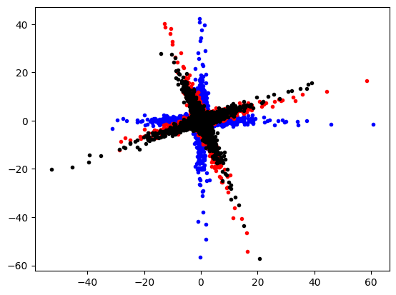
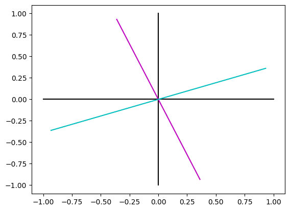

# PCA
{:.no_toc}

<nav markdown="1" class="toc-class">
* TOC
{:toc}
</nav>

## The goal


Questions to [David Rotermund](mailto:davrot@uni-bremen.de)

## Test data

```python
import numpy as np
import matplotlib.pyplot as plt

rng = np.random.default_rng(1)

a_x = rng.normal(0.0, 1.0, size=(5000))[:, np.newaxis]
a_y = rng.normal(0.0, 1.0, size=(5000))[:, np.newaxis] ** 3
data_a = np.concatenate((a_x, a_y), axis=1)

b_x = rng.normal(0.0, 1.0, size=(5000))[:, np.newaxis] ** 3
b_y = rng.normal(0.0, 1.0, size=(5000))[:, np.newaxis]
data_b = np.concatenate((b_x, b_y), axis=1)

data = np.concatenate((data_a, data_b), axis=0)

angle = -0.3

roation_matrix = np.array(
    [[np.cos(angle), -np.sin(angle)], [np.sin(angle), np.cos(angle)]]
)
data_r = data @ roation_matrix

plt.plot(data[:, 0], data[:, 1], "b.")
plt.plot(data_r[:, 0], data_r[:, 1], "r.")
plt.show()
```


## Train and use PCA​ [sklearn.decomposition.PCA](https://scikit-learn.org/stable/modules/generated/sklearn.decomposition.PCA.html#sklearn.decomposition.PCA)

```python
class sklearn.decomposition.PCA(n_components=None, *, copy=True, whiten=False, svd_solver='auto', tol=0.0, iterated_power='auto', n_oversamples=10, power_iteration_normalizer='auto', random_state=None)
```

> Principal component analysis (PCA).
> 
> Linear dimensionality reduction using Singular Value Decomposition of the data to project it to a lower dimensional space. The input data is centered but not scaled for each feature before applying the SVD.
> 
> It uses the LAPACK implementation of the full SVD or a randomized truncated SVD by the method of Halko et al. 2009, depending on the shape of the input data and the number of components to extract.
> 
> It can also use the scipy.sparse.linalg ARPACK implementation of the truncated SVD.
> 
> Notice that this class does not support sparse input. See TruncatedSVD for an alternative with sparse data.

Attributes

> **explained_variance_** : ndarray of shape (n_components,)
> The amount of variance explained by each of the selected components. The variance estimation uses n_samples - 1 degrees of freedom.
> 
> Equal to n_components largest eigenvalues of the covariance matrix of X.

> **singular_values_** : ndarray of shape (n_components,)
> The singular values corresponding to each of the selected components. The singular values are equal to the 2-norms of the n_components variables in the lower-dimensional space.

Methods:

```python
fit(X, y=None)
```

> **X** : array-like of shape (n_samples, n_features)
> 
> Training data, where n_samples is the number of samples and n_features is the number of features.

```python
transform(X)
```

> Apply dimensionality reduction to X.
> 
> X is projected on the first principal components previously extracted from a training set.

> **X** : array-like of shape (n_samples, n_features)
> 
> New data, where n_samples is the number of samples and n_features is the number of features.


We rotate the red cloud back. This creates the black cloud. ​This fits nicely with the original data (blue cloud).

**Be aware that the sign of an ​individual axis can switch!!!​**

```python
import numpy as np
import matplotlib.pyplot as plt
from sklearn.decomposition import PCA

rng = np.random.default_rng(1)

a_x = rng.normal(0.0, 1.0, size=(5000))[:, np.newaxis]
a_y = rng.normal(0.0, 1.0, size=(5000))[:, np.newaxis] ** 3
data_a = np.concatenate((a_x, a_y), axis=1)

b_x = rng.normal(0.0, 1.0, size=(5000))[:, np.newaxis] ** 3
b_y = rng.normal(0.0, 1.0, size=(5000))[:, np.newaxis]
data_b = np.concatenate((b_x, b_y), axis=1)

data = np.concatenate((data_a, data_b), axis=0)

angle = -0.3

roation_matrix = np.array(
    [[np.cos(angle), -np.sin(angle)], [np.sin(angle), np.cos(angle)]]
)
data_r = data @ roation_matrix


pca = PCA(n_components=2)

# Train
pca.fit(data_r)

print(pca.explained_variance_ratio_)  # -> [0.52996112 0.47003888]
print(pca.singular_values_)  # -> [287.55360494 270.80938189]

# Use
transformed_data = pca.transform(data_r)


plt.plot(data[:, 0], data[:, 1], "b.")
plt.plot(data_r[:, 0], data_r[:, 1], "r.")
plt.plot(transformed_data[:, 0], transformed_data[:, 1], "k.")
plt.show()
```


## Use PCA to transform the un-rotated data​ ([inverse_transform(X)](https://scikit-learn.org/stable/modules/generated/sklearn.decomposition.PCA.html#sklearn.decomposition.PCA.inverse_transform))

```python
inverse_transform(X)
```

> Transform data back to its original space.
> 
> In other words, return an input X_original whose transform would be X.

> **X** : array-like of shape (n_samples, n_components)
> 
> New data, where n_samples is the number of samples and n_components is the number of components.

```python
import numpy as np
import matplotlib.pyplot as plt
from sklearn.decomposition import PCA

rng = np.random.default_rng(1)

a_x = rng.normal(0.0, 1.0, size=(5000))[:, np.newaxis]
a_y = rng.normal(0.0, 1.0, size=(5000))[:, np.newaxis] ** 3
data_a = np.concatenate((a_x, a_y), axis=1)

b_x = rng.normal(0.0, 1.0, size=(5000))[:, np.newaxis] ** 3
b_y = rng.normal(0.0, 1.0, size=(5000))[:, np.newaxis]
data_b = np.concatenate((b_x, b_y), axis=1)

data = np.concatenate((data_a, data_b), axis=0)

angle = -0.3

roation_matrix = np.array(
    [[np.cos(angle), -np.sin(angle)], [np.sin(angle), np.cos(angle)]]
)
data_r = data @ roation_matrix


pca = PCA(n_components=2)

# Train
pca.fit(data_r)

# Use
transformed_data = pca.inverse_transform(data)


plt.plot(data[:, 0], data[:, 1], "b.")
plt.plot(data_r[:, 0], data_r[:, 1], "r.")
plt.plot(transformed_data[:, 0], transformed_data[:, 1], "k.")
plt.show()
```



## Inspect the extracted coordinate system

```python
import numpy as np
import matplotlib.pyplot as plt
from sklearn.decomposition import PCA

rng = np.random.default_rng(1)

a_x = rng.normal(0.0, 1.0, size=(5000))[:, np.newaxis]
a_y = rng.normal(0.0, 1.0, size=(5000))[:, np.newaxis] ** 3
data_a = np.concatenate((a_x, a_y), axis=1)

b_x = rng.normal(0.0, 1.0, size=(5000))[:, np.newaxis] ** 3
b_y = rng.normal(0.0, 1.0, size=(5000))[:, np.newaxis]
data_b = np.concatenate((b_x, b_y), axis=1)

data = np.concatenate((data_a, data_b), axis=0)

angle = -0.3

roation_matrix = np.array(
    [[np.cos(angle), -np.sin(angle)], [np.sin(angle), np.cos(angle)]]
)
data_r = data @ roation_matrix


pca = PCA(n_components=2)

# Train
pca.fit(data_r)


plt.plot([-1, 1], [0, 0], "k")
plt.plot([0, 0], [-1, 1], "k")

plt.plot(
    [-pca.components_[0, 0], pca.components_[0, 0]],
    [-pca.components_[0, 1], pca.components_[0, 1]],
    "m",
)

plt.plot(
    [-pca.components_[1, 0], pca.components_[1, 0]],
    [-pca.components_[1, 1], pca.components_[1, 1]],
    "c",
)

plt.show()
```



## PCA methods

|||
|---|---|
|[fit](https://scikit-learn.org/stable/modules/generated/sklearn.decomposition.PCA.html#sklearn.decomposition.PCA.fit)(X[, y])|Fit the model with X.|
|[fit_transform](https://scikit-learn.org/stable/modules/generated/sklearn.decomposition.PCA.html#sklearn.decomposition.PCA.fit_transform)(X[, y])|Fit the model with X and apply the dimensionality reduction on X.|
|[get_covariance](https://scikit-learn.org/stable/modules/generated/sklearn.decomposition.PCA.html#sklearn.decomposition.PCA.get_covariance)()|Compute data covariance with the generative model.|
|[get_feature_names_out](https://scikit-learn.org/stable/modules/generated/sklearn.decomposition.PCA.html#sklearn.decomposition.PCA.get_feature_names_out)([input_features])|Get output feature names for transformation.|
|[get_metadata_routing](https://scikit-learn.org/stable/modules/generated/sklearn.decomposition.PCA.html#sklearn.decomposition.PCA.get_metadata_routing)()|Get metadata routing of this object.|
|[get_params](https://scikit-learn.org/stable/modules/generated/sklearn.decomposition.PCA.html#sklearn.decomposition.PCA.get_params)([deep])|Get parameters for this estimator.|
|[get_precision](https://scikit-learn.org/stable/modules/generated/sklearn.decomposition.PCA.html#sklearn.decomposition.PCA.get_precision)()|Compute data precision matrix with the generative model.|
|[inverse_transform](https://scikit-learn.org/stable/modules/generated/sklearn.decomposition.PCA.html#sklearn.decomposition.PCA.inverse_transform)(X)|Transform data back to its original space.|
|[score](https://scikit-learn.org/stable/modules/generated/sklearn.decomposition.PCA.html#sklearn.decomposition.PCA.score)(X[, y])|Return the average log-likelihood of all samples.|
|[score_samples](https://scikit-learn.org/stable/modules/generated/sklearn.decomposition.PCA.html#sklearn.decomposition.PCA.score_samples)(X)|Return the log-likelihood of each sample.|
|[set_output](https://scikit-learn.org/stable/modules/generated/sklearn.decomposition.PCA.html#sklearn.decomposition.PCA.set_output)(*[, transform])|Set output container.|
|[set_params](https://scikit-learn.org/stable/modules/generated/sklearn.decomposition.PCA.html#sklearn.decomposition.PCA.set_params)(**params)|Set the parameters of this estimator.|
|[transform](https://scikit-learn.org/stable/modules/generated/sklearn.decomposition.PCA.html#sklearn.decomposition.PCA.transform)(X)|Apply dimensionality reduction to X.|

## PCA attributes

> **components_** : ndarray of shape (n_components, n_features)
> 
> Principal axes in feature space, representing the directions of maximum variance in the data. Equivalently, the right singular vectors of the centered input data, parallel to its eigenvectors. The components are sorted by decreasing explained_variance_.

> **explained_variance_** : ndarray of shape (n_components,)
> 
> The amount of variance explained by each of the selected components. The variance estimation uses n_samples - 1 degrees of freedom.
> 
> Equal to n_components largest eigenvalues of the covariance matrix of X.

> **explained_variance_ratio_** : ndarray of shape (n_components,)
> 
> Percentage of variance explained by each of the selected components.
> 
> If n_components is not set then all components are stored and the sum of the ratios is equal to 1.0.

> **singular_values_** : ndarray of shape (n_components,)
> 
> The singular values corresponding to each of the selected components. The singular values are equal to the 2-norms of the n_components variables in the lower-dimensional space.

> **mean_** : ndarray of shape (n_features,)
> 
> Per-feature empirical mean, estimated from the training set.
> 
> Equal to X.mean(axis=0).

> **n_components_** : int
> 
> The estimated number of components. When n_components is set to ‘mle’ or a number between 0 and 1 (with svd_solver == ‘full’) this number is estimated from input data. Otherwise it equals the parameter n_components, or the lesser value of n_features and n_samples if n_components is None.

> **n_features_** : int
> 
> Number of features in the training data.

> **n_samples_** : int
> 
> Number of samples in the training data.

> **noise_variance_** : float
> 
> The estimated noise covariance following the Probabilistic PCA model from Tipping and Bishop 1999. See “Pattern Recognition and Machine Learning” by C. Bishop, 12.2.1 p. 574 or http://www.miketipping.com/papers/met-mppca.pdf. It is required to compute the estimated data covariance and score samples.
> 
> Equal to the average of (min(n_features, n_samples) - n_components) smallest eigenvalues of the covariance matrix of X.

> **n_features_in_** : int
> Number of features seen during fit.

> **feature_names_in_** : ndarray of shape (n_features_in_,)
> 
> Names of features seen during fit. Defined only when X has feature names that are all strings.

