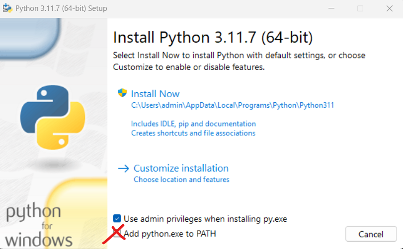

# Python installation (Windows)
{:.no_toc}

<nav markdown="1" class="toc-class">
* TOC
{:toc}
</nav>

## Goal
Install your very own Python and keep everything under control.

Questions to [David Rotermund](mailto:davrot@uni-bremen.de)

We need to download a suitable Python version from [https://www.python.org](https://www.python.org). In the case we want to use PyTorch [check here](https://pytorch.org/get-started/locally/#windows-python) or TensorFlow [check here](https://www.tensorflow.org/install/pip#software_requirements) we need to check if the Python version is okay. 

## Windows

I downloaded this file: 
[https://www.python.org/ftp/python/3.11.7/python-3.11.7-amd64.exe](https://www.python.org/ftp/python/3.11.7/python-3.11.7-amd64.exe)



Select "Add python.exe to Path" and then press "Install Now".

We need to update pip first:

```shell
python.exe -m pip install --upgrade pip
```

### ffmpeg

You might need to create mp4 files. E.g. for saving matplotlib animations

Thus you need ffmpeg binaries. You find them here:
[https://www.gyan.dev/ffmpeg/builds/](https://www.gyan.dev/ffmpeg/builds/)

I went for 
[https://www.gyan.dev/ffmpeg/builds/packages/ffmpeg-6.0-full_build.7z](https://www.gyan.dev/ffmpeg/builds/packages/ffmpeg-6.0-full_build.7z)

There are differnt way to install the ffmpeg binaries (ffmpeg.exe, ffplay.exe, and ffprobe.exe). The easiest way is to put them here: 
%LOCALAPPDATA%\Programs\Python\Python311

### Linux

```shell
mkdir PySource
cd PySource
wget https://www.python.org/ftp/python/3.11.7/Python-3.11.7.tgz
tar -xvzf Python-3.11.7.tgz
cd Python-3.11.7
./configure --prefix=/home/[YOURUSERNAME]/P3.11 --enable-optimizations
make -j 10
make install
```

## Numba 

{: .topic-optional}
This is an optional topic!

The question is: Is numba broken in the moment or not? First we install numpy and then numba. We will observe if numba tried to change the numpy version.

```shell
pip install numpy
```

```shell
pip install numba
```

If so then you have to decide if you want to remove numba and the downgraded numpy version before continuing. I would remove it! 

```shell
pip uninstall numpy numba
```

|Package||
|---|---|
|numba|[Numba is an open source JIT compiler that translates a subset of Python and NumPy code into fast machine code.](https://numba.pydata.org/)|

## Basic Packages you want to install

```shell
pip3 install numpy scipy pandas flake8 pep8-naming black matplotlib seaborn ipython jupyterlab mypy dataclasses-json dataconf ipympl pywavelets scikit-image opencv-python scikit-learn tqdm argh sympy jsmin pybind11 pybind11-stubgen pigar asciichartpy natsort ipykernel 
```

|Package||
|---|---|
|numpy|[The fundamental package for scientific computing with Python](https://numpy.org/)|
|scipy|[Fundamental algorithms for scientific computing in Python](https://scipy.org/)|
|pandas|[pandas is a fast, powerful, flexible and easy to use open source data analysis and manipulation tool](https://pandas.pydata.org/)|
|flake8|[Your Tool For Style Guide Enforcement](https://flake8.pycqa.org/en/latest/)|
|pep8-naming|[Check your code against PEP 8 naming conventions](https://pypi.org/project/pep8-naming/)|
|black|[The uncompromising code formatter](https://black.readthedocs.io/en/stable/index.html)|
|matplotlib|[Visualization with Python](https://matplotlib.org/)|
|seaborn|[seaborn: statistical data visualization](https://seaborn.pydata.org/)|
|ipython|[IPython provides a rich architecture for interactive computing](https://ipython.org/)|
|jupyterlab|[JupyterLab is the latest web-based interactive development environment for notebooks, code, and data.](https://jupyter.org/)|
|mypy|[Mypy is an optional static type checker for Python that aims to combine the benefits of dynamic (or "duck") typing and static typing.](http://mypy-lang.org/")|
|dataclasses-json|[Easily serialize Data Classes to and from JSON](https://github.com/lidatong/dataclasses-json)|
|dataconf|[Simple dataclasses configuration management for Python with hocon/json/yaml/properties/env-vars/dict support](https://github.com/zifeo/dataconf)|
|ipympl|[Matplotlib Jupyter Integration](https://github.com/matplotlib/ipympl)|
|pywavelets|[PyWavelets is open source wavelet transform software for Python.](https://pywavelets.readthedocs.io/en/latest/)|
|scikit-learn|[Simple and efficient tools for predictive data analysis](https://scikit-learn.org/)|
|scikit-image|[Image processing in Python](https://scikit-image.org/)|
|opencv-python|[Open Source Computer Vision Library](https://opencv.org/)|
|tqdm|[A Fast, Extensible Progress Bar for Python and CLI](https://github.com/tqdm/tqdm)|
|argh|[Building a command-line interface?](https://pythonhosted.org/argh/) Found yourself uttering “argh!” while struggling with the API of argparse? Don’t want to lose its power but don’t need the complexity?|
|sympy|[SymPy is a Python library for symbolic mathematics.](https://www.sympy.org/en/index.html)|
|jsmin|[JavaScript minifier](https://github.com/tikitu/jsmin/)|
|pybind11|[Seamless operability between C++11 and Python](https://github.com/pybind/pybind11)|
|pybind11-stubgen|For mypy|
|pigar|[A tool to generate requirements.txt for Python project, and more than that.](https://github.com/damnever/pigar)|
|asciichartpy|[Nice-looking lightweight console ASCII line charts](https://github.com/kroitor/asciichart)|
|natsort|[Simple yet flexible natural sorting in Python.](https://github.com/SethMMorton/natsort)|
|ipykernel|IPython Kernel for Jupyter|

### PyTorch 

[Check here](https://pytorch.org/get-started/locally/#start-locally) for a installation configurator.

**Note: Even if you don't want to use TensorFlow, you want to install it too due to the tensorboard package.** Tensorboard allows to track the progress during learning. 

#### CPU only

```shell
pip3 install torch torchvision torchaudio torchtext 
```

#### NVidia GPU

```shell
pip3 install torch torchvision torchaudio torchtext  --index-url https://download.pytorch.org/whl/cu121
```

|Package||
|---|---|
|torch|[PyTorch is a Python package that provides two high-level features: a. Tensor computation (like NumPy) with strong GPU acceleration b. Deep neural networks built on a tape-based autograd system](https://pytorch.org/)|
|torchvision|[The torchvision package consists of popular datasets, model architectures, and common image transformations for computer vision.](https://github.com/pytorch/vision)|
|torchaudio|[The aim of torchaudio is to apply PyTorch to the audio domain.](https://github.com/pytorch/audio)|
|torchtext|[Models, data loaders and abstractions for language processing, powered by PyTorch](https://github.com/pytorch/text)|

### TensorFlow 

#### CPU only

```shell
pip install tensorflow
```

#### NVidia GPU

```shell
python3 -m pip install tensorflow[and-cuda]
```

|Package||
|---|---|
|tensorflow|[TensorFlow is an open source software library for high performance numerical computation. Its flexible architecture allows easy deployment of computation across a variety of platforms (CPUs, GPUs, TPUs), and from desktops to clusters of servers to mobile and edge devices.](https://www.tensorflow.org/)|

