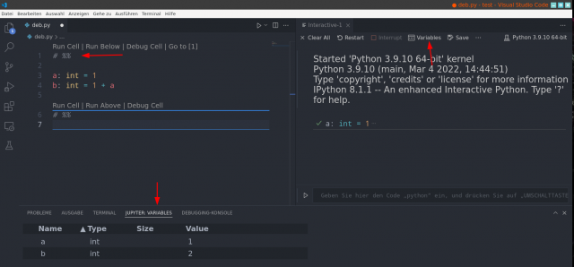
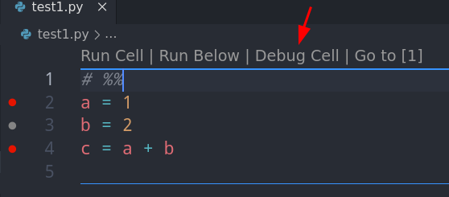

Debugging Python code
{:.no_toc}

<nav markdown="1" class="toc-class">
* TOC
{:toc}
</nav>

## The goal

We want to debug our Python source code like professionals.

Questions to [David Rotermund](mailto:davrot@uni-bremen.de)

## Simple debugging in cell mode 

If we use cells ( # %% ) (i.e. Python Interactive window ) then we can use the Variable button in the interactive Python window to open a variable viewer. 

Also you can interact with the Python kernel directly via the command input line (the lower thing in the interactive window). There you can enter a Python command and press Shift + Enter to execute it. 

## Where to find the debugger (normal mode)?

## Where to find the debugger (cell mode)?

Note: My first Step Over 

click is ignored. Why? I don't know.  

Debugger controls 
Control toolbar

	Continue -- Debugger continues to run the code until the next breakpoint is reached or until the program ends. If end of the program is reached, the debugger closes. 
	Step Over
	Step Into
	Step Out
	Restart -- Starts the debugging process from the beginning. 
	Stop -- Stops the debugging and the debugger closes.
 

Continue vs Step Over vs Step Into vs Step Out
Example code:

# %%
def function(x: int) -> int:
    x += 1
    x += 1
    x += 1
    x += 1
    return x

x = 1
x = function(x)
x = function(x)
x = function(x)
 

Continue

Then  Continue:

 

Step Over
"If the current line contains a function call, Step Over runs the code and then suspends execution at the first line of code after the called function returns."

Then  Step Over:

 

Step Into
"The debugger steps through code statements, not physical lines."
"But when you step into this line, the debugger treats the condition as one step and the consequence as another."
"On a nested function call, Step Into steps into the most deeply nested function. For example, if you use Step Into on a call like Func1(Func2()), the debugger steps into the function Func2."
 

Then  Step Into:

 

Step Out
"Step Out continues running code and suspends execution when the current function returns. The debugger skips through the current function."

 

Then  Step Into:

Then  Step Out :

Breakpoints
Normal Breakpoints
No breakpoint => No debugging. You need to set breakpoints. Thus the debugger know where you want it to stop and allow you to investigate the state of your program. 

You can create breakpoints by making these red dot  in your source code. You just click left beside the line number (with the left mouse button) and get a new breakpoint. 

If you click again then the red dot vanishes and the breakpoint is removed.

You can use the context menu (right mouse button) do deactivate or enable an existing breakpoint. In the case of a disabled breakpoint it turns gray. 

In the breakpoint window, you see all your breakpoints. The X Symbol removes the breakpoint. Removing a blue checkmark disables the corresponding breakpoint. 

Expression
We can use the context menu (right mouse click) to add "Add Conditional Breakpoint...". Expression allow to define a condition that needs to be true to activate the breakpoint. 

Now is a not fully filled dot. 

You can use the context menu to change the condition or delete the breakpoint. 

If you start debugging, this is where the debugger stops as initial breakpoint: 

Hit Count
Hit Count (defined via the context menu) allows to set an integer value for how often a position in a source code needs to be "hit" (i.e. run) until a breakpoint is activated.

If you start debugging, this is where the debugger stops as initial breakpoint: 

Log Message / Add Log Point...
Log Message allows you to add the generation debug messages (messages in the debug console). If this "breakpoint" is passed by the debugger then a debug message is generated. However this is not a breakpoint that stops running the program like a normal breakpoint would. The message is defined akin to "Formatted String Literals" (also called f-string).

Running the debugger creates the following messages in the Debug Console:

Function Breakpoints
In the Breakpoints window we can add Function Breakpoints. If the function named in the list is called that a breakpoint is initiated. 

Use the + symbol:

Raise Exception Breakpoints
You can break on throwing exceptions even if we catch them. However, we need another breakpoint (disabled or enabled) otherwise we cannot enable the Raise Exception breakpoints.   

Starting the debug process
When we are happy with the placement of the breakpoints, we click on "Run and Debug". Then we tell the debugger that this is a Python file. 

The yellow thingy tells us where in the source code we are in the moment:

If we press Continue then the debugger goes to the next breakpoint and we can view the content of the variables:

Watch window
You can add variables to the watch window. This allows to observe variables and we can even watch slices of a numpy array:

You can add variables from the variable window via the context menu.

Debug console
When the debugger waits for the next command from us, we can use the Debug Console to interact with the program. For example: We can print the value of variables or replace them with new values. If the console is not open already then you find it in the menu under View -> Debug Console.

## References
* Navigate through code by using the Visual Studio debugger
* Debugging in VS Code
* Python debugging in VS Code
